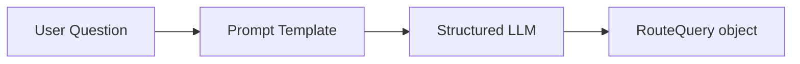
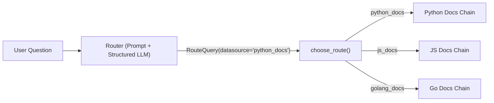
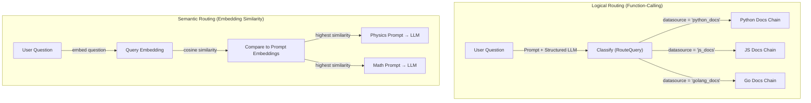

# RAG From Scratch – Part 10 Walkthrough

> Line-by-line explanation of [`part_10.ipynb`](file:///c:/Users/abdel/OneDrive/Desktop/rag_tutorial/src/part_10_and_11/part_10.ipynb)

---

## 📋 LangChain vs LangGraph Recap (Cell 1 – Markdown)

The notebook opens with a comprehensive reference table comparing **LangChain** and **LangGraph** — the two main frameworks used throughout this tutorial series. This is not executable code, but understanding these concepts is essential for Parts 10 and beyond where we start composing chains, graphs, and routing logic.

### 1. High-Level Architecture

| Layer            | Purpose                       | Typical Components                  | Who Owns It |
| ---------------- | ----------------------------- | ----------------------------------- | ----------- |
| Capability Layer | Provides AI functionality     | LLMs, Tools, Prompts                | LangChain   |
| Execution Layer  | Controls flow of execution    | Graph nodes, edges, reducers        | LangGraph   |
| Agent Memory     | Stores agent reasoning state  | AgentState                          | LangChain   |
| Workflow State   | Data passed between steps     | TypedDict State                     | LangGraph   |
| Runtime Context  | External configuration        | dataclass context                   | Application |
| Data Contracts   | Validate structured I/O       | Pydantic BaseModel                  | Tools / APIs|

> **LangChain** = the toolkit (LLMs, prompts, tools). **LangGraph** = the orchestration engine (graph workflows, state management, parallel execution).

### 2. Key Concepts Compared

| Concept           | Think of it as                       |
| ----------------- | ------------------------------------ |
| LangChain         | AI capability toolkit                |
| LangGraph         | Workflow execution engine            |
| AgentState        | What the agent remembers             |
| TypedDict State   | Data flowing through the workflow    |
| dataclass Context | Configuration provided to the system |
| BaseModel         | Contract enforcing structured data   |

> **Why this matters for Part 10**: Routing uses **LangChain** components (LLMs, prompts, structured output) to decide _where_ a query should go. In production, these routing decisions would be nodes inside a **LangGraph** workflow.

---

## ⚙️ Environment Initialization (Cell 3 – Code)

```python
import warnings
import os
from dotenv import load_dotenv
```

| Import                           | Role                                                 |
| -------------------------------- | ---------------------------------------------------- |
| `warnings`                       | Built-in module to control warning messages          |
| `os`                             | Built-in module for environment variable access      |
| `from dotenv import load_dotenv` | Loads variables from a `.env` file into `os.environ` |

```python
warnings.filterwarnings("ignore")
```

Suppresses all Python warnings so the output stays clean.

```python
load_dotenv()
```

Reads the `.env` file in the project root and loads its key-value pairs into environment variables. `load_dotenv()` searches for `.env` starting from the current working directory and walking up parent directories.

```python
try:
    os.environ["LANGCHAIN_TRACING_V2"] = os.getenv("LANGSMITH_TRACING_V2")
    os.environ["LANGCHAIN_API_KEY"]    = os.getenv("LANGSMITH_API_KEY")
    os.environ["LANGCHAIN_PROJECT"]    = os.getenv("LANGSMITH_PROJECT")
    os.environ["LANGCHAIN_ENDPOINT"]   = os.getenv("LANGSMITH_ENDPOINT")
    os.environ["MISTRAL_API_KEY"]      = os.getenv("MISTRAL_API_KEY")
    os.environ["HF_TOKEN"]             = os.getenv("HF_TOKEN")
    os.environ["USER_AGENT"]           = "MyLangChainApp/1.0"
    print("Environment variables set successfully")
except Exception as e:
    print(f"Error: {e}")
```

| Variable               | Purpose                                           |
| ---------------------- | ------------------------------------------------- |
| `LANGCHAIN_TRACING_V2` | Enables **LangSmith** tracing (observability)     |
| `LANGCHAIN_API_KEY`    | API key to authenticate with LangSmith            |
| `LANGCHAIN_PROJECT`    | LangSmith project name to group traces            |
| `LANGCHAIN_ENDPOINT`   | LangSmith API endpoint URL                        |
| `MISTRAL_API_KEY`      | API key for the **Mistral AI** LLM & embeddings   |
| `HF_TOKEN`             | Hugging Face token for model/dataset access       |
| `USER_AGENT`           | Required header for `WebBaseLoader` HTTP requests |

> The `try/except` block catches any errors during setup and prints them instead of crashing the notebook.

**Output:** `Environment variables set successfully`

---

## 🚦 Part 10: Logical and Semantic Routing

### What is Routing?

Routing is the process of **directing a user's query to the most appropriate processing path** before any retrieval or generation happens. Think of it as a traffic controller for your RAG system — different questions need different data sources, prompts, or even entirely different pipelines.

**Why routing matters:**

- **Multiple data sources** — Your system might have Python docs, JavaScript docs, and Go docs in separate vector stores. Sending a Python question to the JS docs store wastes compute and returns irrelevant results.
- **Specialized prompts** — A physics question should be answered by a physics expert prompt, not a math prompt.
- **Efficiency** — Routing avoids searching all data sources for every query.

**Two routing strategies are explored in this notebook:**

| Strategy              | How it decides                                      | Best for                                         |
| --------------------- | --------------------------------------------------- | ------------------------------------------------ |
| **Logical Routing**   | LLM uses function-calling to classify the query     | Discrete categories (e.g., which datasource)     |
| **Semantic Routing**  | Compares query embedding to prompt embeddings       | Choosing between prompts based on topic similarity|

---

### Cell 4 – Markdown: Logical Routing Introduction

The notebook introduces **Logical Routing** with an image diagram showing the flow:

1. User question comes in
2. LLM classifies the question using function-calling (structured output)
3. The classification result determines which downstream chain to execute

> **Key concept**: Logical routing uses the LLM as a **classifier**. The LLM doesn't answer the question — it only decides _where_ the question should go.

---

### Cell 5 – Logical Routing: Imports, Data Model, Router Chain (Code)

#### Imports

```python
from typing import Literal
from langchain_core.prompts import ChatPromptTemplate
from pydantic import BaseModel, Field
from langchain_mistralai import ChatMistralAI
```

| Import               | Source                 | Role                                                                         |
| -------------------- | ---------------------- | ---------------------------------------------------------------------------- |
| `Literal`            | `typing`               | Restricts a type to specific allowed values (like an enum)                   |
| `ChatPromptTemplate` | `langchain_core`       | Builds structured prompt templates with system/human messages                |
| `BaseModel`          | `pydantic`             | Base class for creating validated data models with type checking             |
| `Field`              | `pydantic`             | Adds metadata (description, constraints) to model fields                     |
| `ChatMistralAI`      | `langchain_mistralai`  | Mistral AI chat model wrapper                                                |

> **`Literal`** comes from Python's `typing` module (Python 3.8+). It restricts a variable to an exact set of allowed string values — like a stricter version of an `Enum`. Here it limits `datasource` to exactly three valid options.

> **`BaseModel`** from Pydantic is fundamental to how LangChain handles **structured output**. When you pass a `BaseModel` subclass to `llm.with_structured_output()`, LangChain tells the LLM to produce JSON matching that schema — this is called **function calling** or **tool use** under the hood.

> **`Field(...)`** — The `...` (Ellipsis) as the first argument means the field is **required** (no default value). The `description` parameter tells the LLM what this field represents, which helps it make better classification decisions.

#### Data Model

```python
class RouteQuery(BaseModel):
    """Route a user query to the most relevant datasource."""
    datasource: Literal["python_docs", "js_docs", "golang_docs"] = Field(
        ...,
        description="Given a user question choose which datasource would be most relevant for answering their question",
    )
```

**Line-by-line breakdown:**

| Line                                                 | What it does                                                                              |
| ---------------------------------------------------- | ----------------------------------------------------------------------------------------- |
| `class RouteQuery(BaseModel):`                       | Defines a Pydantic model — a structured data shape the LLM must output                    |
| `"""Route a user query..."""`                        | Docstring — LangChain sends this to the LLM as the function description                   |
| `datasource: Literal["python_docs", "js_docs", ...]` | A single field that **must** be one of exactly three string values                        |
| `Field(..., description=...)`                        | The field is required (`...`), and the description guides the LLM's classification logic  |

> **How this becomes function-calling**: When you pass `RouteQuery` to `with_structured_output()`, LangChain converts it into a JSON schema and sends it to the Mistral API as a "tool" definition. The LLM then fills in `datasource` with one of the three allowed values based on the question content. This is **not** free-form text generation — the LLM is constrained to produce valid JSON matching this exact schema.

> **Why Pydantic over a plain dict?** Pydantic provides **runtime validation** — if the LLM somehow returns `"ruby_docs"`, Pydantic will raise a validation error. With a plain dict, you'd get silent incorrect routing.

#### LLM with Structured Output

```python
llm = ChatMistralAI(model="mistral-medium-latest", temperature=0)
structured_llm = llm.with_structured_output(RouteQuery)
```

| Line                                        | What it does                                                                       |
| ------------------------------------------- | ---------------------------------------------------------------------------------- |
| `ChatMistralAI(model="mistral-medium-latest", temperature=0)` | Creates a Mistral chat model — `temperature=0` for deterministic classification    |
| `llm.with_structured_output(RouteQuery)`    | Wraps the LLM so it always returns a `RouteQuery` object instead of free-form text |

> **`.with_structured_output()`** is a LangChain method available on chat models that support function-calling (Mistral, OpenAI, Anthropic, etc.). Under the hood it:
> 1. Converts the Pydantic model to a JSON schema
> 2. Sends it to the LLM API as a "tool" / "function" definition
> 3. Parses the LLM's structured JSON response back into a `RouteQuery` Python object
>
> The result is that `structured_llm.invoke(...)` returns a `RouteQuery` instance, not an `AIMessage`.

#### Prompt

```python
system = """You are an expert at routing a user question to the appropriate data source.

Based on the programming language the question is referring to, route it to the relevant data source."""

prompt = ChatPromptTemplate.from_messages(
    [
        ("system", system),
        ("human", "{question}"),
    ]
)
```

| Line                                    | What it does                                                                       |
| --------------------------------------- | ---------------------------------------------------------------------------------- |
| `system = """..."""`                    | System message establishing the LLM's role as a routing expert                     |
| `ChatPromptTemplate.from_messages([])`  | Creates a structured prompt with system and human message slots                    |
| `("system", system)`                    | Sets the system instruction — tells the LLM to route by programming language       |
| `("human", "{question}")`              | Placeholder for the user's actual question                                         |

> **`ChatPromptTemplate.from_messages()`** vs **`ChatPromptTemplate.from_template()`**: The `from_messages()` version creates a multi-turn chat prompt with explicit roles (system, human, ai). The `from_template()` version used in earlier parts creates a single-turn prompt. Multi-turn is preferred when you need a system instruction to set the LLM's behavior.

#### Define Router

```python
router = prompt | structured_llm
```

This creates an **LCEL chain** (LangChain Expression Language) using the pipe `|` operator:



1. The question fills `{question}` in the prompt
2. The prompt is sent to the structured LLM
3. The LLM returns a `RouteQuery` object with `datasource` set to one of the three values

---

### Cell 6 – Markdown: Function Calling Note

> **Note**: We used **function calling** to produce structured output. Function calling (also called "tool use") is a feature of modern LLMs where instead of generating free-form text, the LLM generates a structured JSON object matching a predefined schema. This is far more reliable than asking the LLM to output JSON as text and then parsing it manually.

---

### Cell 7 – Test the Router (Code)

```python
question = """Why doesn't the following code work:

from langchain_core.prompts import ChatPromptTemplate

prompt = ChatPromptTemplate.from_messages(["human", "speak in {language}"])
prompt.invoke("french")
"""

result = router.invoke({"question": question})

result
```

**Line-by-line breakdown:**

| Line                                       | What it does                                                       |
| ------------------------------------------ | ------------------------------------------------------------------ |
| `question = """..."""`                     | A multi-line question about **Python** code using LangChain        |
| `router.invoke({"question": question})`    | Sends the question through the prompt → structured LLM chain       |
| `result`                                   | Displays the returned `RouteQuery` object                          |

**Output:** `RouteQuery(datasource='python_docs')`

> The LLM correctly identified that the question is about **Python** code (it uses `from langchain_core...`, which is Python syntax) and routed it to `python_docs`.

---

### Cell 8 – Access the Routing Result (Code)

```python
result.datasource
```

**Output:** `'python_docs'`

> Since `result` is a Pydantic `RouteQuery` object, you access the routing decision via standard Python attribute access (`.datasource`). This is the value you'd use in an `if/else` block or graph edge to direct the query downstream.

---

### Cell 9 – Markdown: Branching Note

> _"Once we have this, it is trivial to define a branch that uses `result.datasource`"_

This sets up the next cell, which shows how to use the routing result to select a downstream chain.

---

### Cell 10 – Conditional Branching with RunnableLambda (Code)

```python
from langchain_core.runnables import RunnableLambda
```

| Import           | Source           | Role                                                               |
| ---------------- | ---------------- | ------------------------------------------------------------------ |
| `RunnableLambda` | `langchain_core` | Wraps any Python function into a LangChain-compatible "Runnable"   |

> **`RunnableLambda`** turns a plain Python function into something you can plug into LCEL chains with the `|` operator. Without it, you can't put custom logic (like `if/else` routing) inside a chain.

```python
def choose_route(result):
    if "python_docs" in result.datasource.lower():
        # WE ADD THE LOGIC HERE IF ANY FOR Python Docs
        return "chain for python_docs"
    if "js_docs" in result.datasource.lower():
        # WE ADD THE LOGIC HERE IF ANY FOR JS Docs
        return "chain for js_docs"
    else:
        # WE ADD THE LOGIC HERE IF ANY FOR GoLang Docs
        return "chain for golang_docs"
```

**Line-by-line breakdown:**

| Line                                              | What it does                                                         |
| ------------------------------------------------- | -------------------------------------------------------------------- |
| `def choose_route(result):`                       | Receives the `RouteQuery` object from the router                     |
| `result.datasource.lower()`                       | Gets the datasource string and lowercases it for safe comparison     |
| `if "python_docs" in ...:`                        | Checks if the LLM routed to Python docs                              |
| `return "chain for python_docs"`                  | In production, this would invoke the actual Python docs RAG chain    |
| `if "js_docs" in ...:`                            | Checks for JavaScript docs routing                                   |
| `else:`                                           | Default fallback — any other value goes to Go docs                   |

> **In production**, instead of returning placeholder strings, each branch would invoke a complete RAG chain connected to the appropriate vector store. For example:
> ```python
> if "python_docs" in result.datasource.lower():
>     return python_rag_chain.invoke({"question": original_question})
> ```

```python
full_chain = router | RunnableLambda(choose_route)

full_chain.invoke({"question": question})
```

| Line                                      | What it does                                                           |
| ----------------------------------------- | ---------------------------------------------------------------------- |
| `router \| RunnableLambda(choose_route)`  | Chains the router → branching function                                  |
| `full_chain.invoke(...)`                  | Runs the complete pipeline: classify → route → execute branch           |

**Output:** `'chain for python_docs'`

**Data flow:**



> **Key takeaway**: Logical routing = LLM classification + conditional branching. The LLM picks a category, and your code decides what to do with it. It's deterministic given the same input (because `temperature=0`).

---

## 🧭 Semantic Routing

### What is Semantic Routing?

Semantic routing takes a different approach from logical routing. Instead of using the LLM to **classify** a query into categories, it uses **embedding similarity** to find the best-matching prompt template.

**How it works:**

1. You define multiple prompt templates (e.g., one for physics, one for math).
2. You **embed** the prompt templates themselves into vectors.
3. When a user asks a question, you **embed the question** and compare it to all prompt embeddings using **cosine similarity**.
4. The prompt with the **highest similarity** is selected as the "expert" for that question.
5. The question is sent to the LLM using the chosen prompt.

**Key difference from Logical Routing:**

| Aspect              | Logical Routing                     | Semantic Routing                        |
| ------------------- | ----------------------------------- | --------------------------------------- |
| Decision maker      | LLM (function-calling)              | Embedding similarity (cosine distance)  |
| Categories          | Predefined in Pydantic model        | Defined by prompt templates             |
| Speed               | Requires an LLM call for routing    | Only needs embedding + cosine similarity|
| Flexibility         | Can handle complex reasoning        | Best for topic similarity matching      |
| Cost                | Higher (LLM inference)              | Lower (just embedding computation)      |

**Why it helps:** For simple topic-based routing (physics vs. math), semantic routing is **faster and cheaper** than logical routing because it doesn't need an LLM call — just an embedding comparison. However, it's less flexible for complex routing decisions that require reasoning.

---

### Cell 11 – Markdown: Semantic Routing Introduction

The notebook introduces **Semantic Routing** with a flow diagram showing:

1. User question is embedded
2. Question embedding is compared to pre-embedded prompts
3. The most similar prompt is selected
4. The question + selected prompt are sent to the LLM

---

### Cell 12 – Semantic Routing: Full Implementation (Code)

#### Imports

```python
from langchain_community.utils.math import cosine_similarity
from langchain_core.output_parsers import StrOutputParser
from langchain_core.prompts import PromptTemplate
from langchain_core.runnables import RunnableLambda, RunnablePassthrough
from langchain_mistralai import ChatMistralAI, MistralAIEmbeddings
```

| Import                | Source                    | Role                                                                    |
| --------------------- | ------------------------- | ----------------------------------------------------------------------- |
| `cosine_similarity`   | `langchain_community`     | Computes cosine similarity between vectors (LangChain's utility)        |
| `StrOutputParser`     | `langchain_core`          | Extracts plain text from the LLM response                               |
| `PromptTemplate`      | `langchain_core`          | Creates a simple prompt template with `{variable}` placeholders         |
| `RunnableLambda`      | `langchain_core`          | Wraps a Python function as a runnable chain component                   |
| `RunnablePassthrough` | `langchain_core`          | Passes input through unchanged — carries data forward in chains         |
| `ChatMistralAI`       | `langchain_mistralai`     | Mistral AI chat model wrapper                                           |
| `MistralAIEmbeddings` | `langchain_mistralai`     | Mistral AI embeddings model for converting text to vectors              |

> **`cosine_similarity` from LangChain** vs the manual implementation in Part 2: In Part 2 (Cell 7), we implemented cosine similarity from scratch using NumPy to understand the math. Here, LangChain provides a utility version that handles batched comparisons — you pass a list of query embeddings and a matrix of document embeddings, and it returns a similarity matrix.

> **`PromptTemplate`** vs **`ChatPromptTemplate`**: `PromptTemplate` is a simpler, single-string template (no system/human roles). `ChatPromptTemplate` supports multi-turn messages. Here `PromptTemplate` is used because the prompt templates are just standalone text blocks, not conversations.

#### Define Expert Prompts

```python
physics_template = """You are a very smart physics professor. \
You are great at answering questions about physics in a concise and easy to understand manner. \
When you don't know the answer to a question you admit that you don't know.

Here is a question:
{query}"""

math_template = """You are a very good mathematician. You are great at answering math questions. \
You are so good because you are able to break down hard problems into their component parts, \
answer the component parts, and then put them together to answer the broader question.

Here is a question:
{query}"""
```

| Template            | Expert persona                              | Key behavior                                |
| ------------------- | ------------------------------------------- | ------------------------------------------- |
| `physics_template`  | Smart physics professor                     | Concise, admits when unsure                 |
| `math_template`     | Mathematician who breaks problems into parts| Decomposition approach to problem solving   |

> Both templates use `{query}` (not `{question}`) as the placeholder — this is important because later the chain sends input with `"query"` as the key.

> The `\` at the end of some lines is a **Python line continuation character** inside the string — it prevents a newline from being inserted at that point, keeping the sentence on one logical line.

#### Embed the Prompts

```python
embeddings = MistralAIEmbeddings(model="mistral-embed")
prompt_template = [physics_template, math_template]
prompt_embeddings = embeddings.embed_documents(prompt_template)
```

| Line                                              | What it does                                                           |
| ------------------------------------------------- | ---------------------------------------------------------------------- |
| `MistralAIEmbeddings(model="mistral-embed")`      | Creates the embedding model (same 1024-dim model used throughout)      |
| `prompt_template = [physics_template, math_template]` | Puts both prompts in a list for batch embedding                     |
| `embeddings.embed_documents(prompt_template)`      | Embeds both prompt strings → returns a list of two 1024-dim vectors   |

> **`.embed_documents()`** embeds a **list** of strings in a single API call (batch operation). This is different from `.embed_query()`, which embeds a single string. Using `embed_documents` is more efficient when you have multiple texts to embed.

> **What happens here conceptually**: Each prompt template is converted into a 1024-dimensional vector that captures its "semantic meaning." The physics prompt's vector will be closer to physics-related text; the math prompt's vector will be closer to math-related text. Later, when a user asks a question, we compare the question's vector to these prompt vectors to find the best match.

#### Prompt Router Function

```python
def prompt_router(input):
    # Embed Question
    query_embedding = embeddings.embed_query(input["query"])

    # Compute Similarity
    similarity = cosine_similarity([query_embedding], prompt_embeddings)[0]
    most_similar = prompt_template[similarity.argmax()]

    # Chosen Prompt
    print("Using MATH" if most_similar == math_template else "Using PHYSICS")
    return PromptTemplate.from_template(most_similar)
```

**Line-by-line breakdown:**

| Line                                                    | What it does                                                                         |
| ------------------------------------------------------- | ------------------------------------------------------------------------------------ |
| `def prompt_router(input):`                             | Function that receives the chain's input dictionary                                  |
| `input["query"]`                                        | Extracts the user's question string from the input                                   |
| `embeddings.embed_query(input["query"])`                | Embeds the user's question into a 1024-dim vector                                    |
| `cosine_similarity([query_embedding], prompt_embeddings)` | Compares the question vector against **both** prompt vectors                       |
| `[0]`                                                   | Gets the first (and only) row from the similarity matrix                             |
| `similarity.argmax()`                                   | Finds the **index** of the highest similarity score (0 = physics, 1 = math)          |
| `prompt_template[similarity.argmax()]`                  | Selects the prompt template with the highest similarity                               |
| `print("Using MATH" if ...)`                            | Logs which prompt was selected (for debugging)                                        |
| `return PromptTemplate.from_template(most_similar)`     | Returns the selected prompt as a `PromptTemplate` object for the chain               |

> **`cosine_similarity([query_embedding], prompt_embeddings)`** returns a 2D array of shape `(1, 2)` — one row (the query) compared against two columns (physics prompt, math prompt). Taking `[0]` gives us the 1D array `[sim_physics, sim_math]`.

> **`similarity.argmax()`** returns the index of the maximum value. If `sim_physics = 0.82` and `sim_math = 0.71`, `argmax()` returns `0` → selects `physics_template`.

> **Key design pattern**: The function returns a **`PromptTemplate` object**, not a string. This means the next step in the chain receives a prompt template, fills in `{query}`, and sends it to the LLM. This is a dynamic prompt selection pattern — the prompt itself is chosen at runtime based on the question.

#### Build and Run the Chain

```python
chain = (
    {"query": RunnablePassthrough()}
    | RunnableLambda(prompt_router)
    | ChatMistralAI(model="mistral-medium-latest", temperature=0)
    | StrOutputParser()
)

print(chain.invoke("What's a black hole"))
```

**Line-by-line breakdown:**

| Line                                                         | What it does                                                           |
| ------------------------------------------------------------ | ---------------------------------------------------------------------- |
| `{"query": RunnablePassthrough()}`                           | Takes the raw input string and wraps it as `{"query": "..."}`          |
| `RunnableLambda(prompt_router)`                              | Calls `prompt_router()` to select the best prompt based on similarity  |
| `ChatMistralAI(model="mistral-medium-latest", temperature=0)` | Sends the filled prompt to the Mistral LLM                           |
| `StrOutputParser()`                                          | Extracts the response as a plain string                                |
| `chain.invoke("What's a black hole")`                        | Runs the full chain with a physics question                            |

**Data flow:**

```mermaid
flowchart LR
    Q["'What's a black hole'"] --> RP["RunnablePassthrough"]
    RP --> |'{"query": "What is a black hole"}'| PR["prompt_router()"]
    PR --> |"Embed question, compare to prompt embeddings"| CS["Cosine Similarity"]
    CS --> |"Physics prompt wins"| PT["PromptTemplate (physics)"]
    PT --> |"Filled prompt"| LLM["Mistral LLM"]
    LLM --> SP["StrOutputParser"]
    SP --> A["Physics answer about black holes"]
```

**Step-by-step execution:**

1. `"What's a black hole"` is passed as input
2. `RunnablePassthrough()` wraps it: `{"query": "What's a black hole"}`
3. `prompt_router()` embeds the question and compares it to both prompt embeddings
4. Cosine similarity is higher for the **physics** prompt → selects `physics_template`
5. `PromptTemplate.from_template(physics_template)` fills `{query}` → full prompt is created
6. The filled prompt goes to the **Mistral LLM**
7. The LLM generates a comprehensive answer about black holes
8. `StrOutputParser()` extracts the response as a plain string

**Output:** `Using PHYSICS` followed by a detailed, concise explanation of black holes covering formation, event horizons, singularity, types, and open questions.

---

### Cell 13 – Markdown: RunnableLambda vs RunnablePassthrough Explained

The notebook ends with a reference explanation of two core LangChain runnables used throughout this part:

| Tool                | Analogy              | Best For                                        |
| ------------------- | -------------------- | ----------------------------------------------- |
| `RunnableLambda`    | A custom machine     | Transforming data or running custom logic       |
| `RunnablePassthrough` | A clear conveyor belt | Passing data forward unchanged or adding keys |

**`RunnableLambda`** — The Custom Worker:
- Wraps any Python function so it can be used inside an LCEL chain with the `|` operator.
- Used whenever you need custom logic: formatting text, routing, calling external APIs, cleaning data.
- **In this notebook**: `choose_route()` and `prompt_router()` are both wrapped in `RunnableLambda`.

**`RunnablePassthrough`** — The Conveyor Belt:
- Passes data from one step to the next **without changing it**.
- Most commonly used to "carry" the user's original input forward while other operations happen in parallel.
- Also supports `.assign()` to add new keys alongside the passed-through data.
- **In this notebook**: `{"query": RunnablePassthrough()}` wraps the raw string input as `{"query": "..."}` to make it accessible by key.

> **When to use which**: If you need to **transform** input → `RunnableLambda`. If you need to **forward** input unchanged → `RunnablePassthrough`. They are the two fundamental building blocks for custom LCEL chain logic.

---

## 🗺️ Overall Architecture



---

## 📊 Routing Techniques Compared

| Aspect               | Logical Routing                        | Semantic Routing                            |
| -------------------- | -------------------------------------- | ------------------------------------------- |
| **Decision method**  | LLM function-calling (classification)  | Embedding cosine similarity                 |
| **Speed**            | Slower (requires LLM inference)        | Faster (only embedding + math)              |
| **Cost**             | Higher (LLM call for routing)          | Lower (embedding call only)                 |
| **Flexibility**      | High — LLM can reason about edge cases | Lower — purely based on semantic distance   |
| **Output**           | Structured Pydantic object             | Selected prompt template                    |
| **Categories**       | Defined in Pydantic model (`Literal`)  | Defined by prompt templates                 |
| **Best for**         | Discrete, well-defined categories      | Topic-based prompt selection                |
| **Error handling**   | Pydantic validation catches bad output | Silently picks closest match (no validation)|

> **When to use which**: Use **Logical Routing** when you have clear, discrete categories and need the LLM to reason about the correct destination. Use **Semantic Routing** when you want fast, cheap topic-based routing and your prompts naturally cluster by topic.

---

## 📦 Key Dependencies

| Package                | Purpose                                                |
| ---------------------- | ------------------------------------------------------ |
| `langchain-core`       | Core abstractions (prompts, parsers, runnables)        |
| `langchain-community`  | Utility functions (`cosine_similarity`)                |
| `langchain-mistralai`  | Mistral AI LLM & embedding wrappers                   |
| `pydantic`             | Data validation and structured output (BaseModel)      |
| `python-dotenv`        | `.env` file loading                                    |

---

## ✅ Best Practices for Routing

### 🚦 General Routing

| Practice                                                                     | Why                                                              |
| ---------------------------------------------------------------------------- | ---------------------------------------------------------------- |
| **Always set `temperature=0`** for routing decisions                         | Routing must be deterministic — same question = same route       |
| **Log routing decisions** (`print` or LangSmith tracing)                     | Critical for debugging wrong answers caused by misrouting        |
| **Add a default/fallback route**                                             | Handles edge cases where the LLM is uncertain                   |
| **Test with edge cases** — ambiguous questions that could match multiple     | Reveals weaknesses in your routing logic before users find them  |
| **Keep route categories distinct** — avoid overlapping category definitions  | Overlap causes inconsistent routing                              |

### 🔧 Logical Routing

| Practice                                                                      | Why                                                               |
| ----------------------------------------------------------------------------- | ----------------------------------------------------------------- |
| **Use Pydantic `BaseModel`** with `Literal` types for strict validation       | Catches invalid routing results at the schema level               |
| **Write a clear system prompt** explaining the routing criteria               | The LLM needs explicit instructions on how to classify            |
| **Include a `description`** in the Pydantic `Field`                           | Helps the LLM understand what the field represents                |
| **Use function-calling (`with_structured_output`)** over text parsing         | Far more reliable than parsing free-form LLM text                 |

### 🧭 Semantic Routing

| Practice                                                                      | Why                                                               |
| ----------------------------------------------------------------------------- | ----------------------------------------------------------------- |
| **Embed prompts once** at startup — not per request                           | Prompt embeddings are static; re-embedding wastes API calls       |
| **Use `embed_documents` for batch embedding** prompts                         | More efficient than calling `embed_query` multiple times          |
| **Ensure prompt templates are semantically distinct**                         | Similar prompts will produce similar embeddings → unreliable      |
| **Consider adding more prompt templates** as your domain grows               | Semantic routing scales naturally with more prompt embeddings     |
| **Print similarity scores** during development                               | Helps verify that the correct prompt is being selected            |
