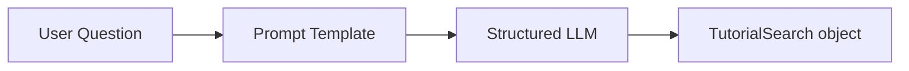
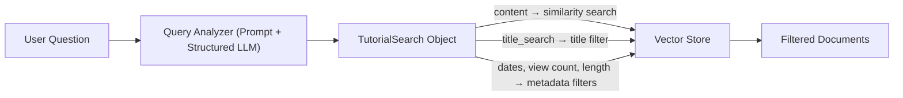
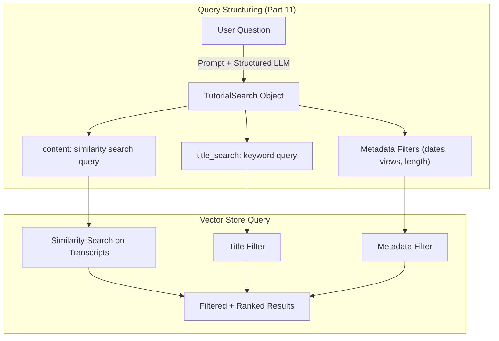

# RAG From Scratch – Part 11 Walkthrough

> Line-by-line explanation of [`part_11.ipynb`](file:///c:/Users/abdel/OneDrive/Desktop/rag_tutorial/src/part_10_and_11/part_11.ipynb)

---

## 📋 LangChain vs LangGraph Recap (Cell 0 – Markdown)

The notebook opens with the same comprehensive reference table from Part 10, comparing **LangChain** and **LangGraph**. This recap is shared between Parts 10 and 11 since both notebooks live in the same `part_10_and_11` directory.

The recap covers:

| Section                          | Key Takeaway                                                                                       |
| -------------------------------- | -------------------------------------------------------------------------------------------------- |
| 1. High-Level Architecture       | Six layers — Capability, Execution, Agent Memory, Workflow State, Runtime Context, Data Contracts  |
| 2. LangChain vs LangGraph        | LangChain = AI capability toolkit, LangGraph = workflow execution engine                           |
| 3. AgentState vs TypedDict State | AgentState = agent's internal memory (mutable), TypedDict = workflow's shared state (functional)   |
| 4. dataclass Context vs AgentState | dataclass = static runtime config, AgentState = dynamic agent memory                            |
| 5. TypedDict vs BaseModel        | TypedDict = dict structure (no runtime validation), BaseModel = Pydantic validated data             |
| 6. State Evolution               | AgentState grows continuously, TypedDict is controlled by selective updates + reducers              |
| 7. Mental Model                  | Quick one-liner for each concept                                                                    |
| 8. Architecture Diagram          | Shows how Application → LangGraph Workflow → LangChain Agent layers nest together                  |

> **Why this matters for Part 11**: Query structuring uses **LangChain** components (LLMs, prompts, structured output via Pydantic `BaseModel`) to convert user questions into structured metadata queries. The `BaseModel` from Pydantic is used as a **data contract** that defines what a valid query looks like.

---

## 🖼️ Query Construction Overview (Cell 1 – Markdown with Image)

The notebook shows a diagram titled **"RAG From Scratch: Query Construction"** illustrating how natural language queries can be converted into structured database queries.

> **Key concept**: Instead of searching only on text similarity, real-world vector stores have **metadata fields** (like dates, view counts, titles, etc.). Query construction converts user questions into structured filters that work alongside similarity search — making retrieval far more precise.

---

## ⚙️ Environment Initialization (Cell 2 – Code)

```python
import warnings
import os
from dotenv import load_dotenv
```

| Import                           | Role                                                 |
| -------------------------------- | ---------------------------------------------------- |
| `warnings`                       | Built-in module to control warning messages          |
| `os`                             | Built-in module for environment variable access      |
| `from dotenv import load_dotenv` | Loads variables from a `.env` file into `os.environ` |

```python
warnings.filterwarnings("ignore")
```

Suppresses all Python warnings so the output stays clean.

```python
load_dotenv()
```

Reads the `.env` file in the project root and loads its key-value pairs into environment variables. `load_dotenv()` searches for `.env` starting from the current working directory and walking up parent directories.

```python
try:
    os.environ["LANGCHAIN_TRACING_V2"] = os.getenv("LANGSMITH_TRACING_V2")
    os.environ["LANGCHAIN_API_KEY"]    = os.getenv("LANGSMITH_API_KEY")
    os.environ["LANGCHAIN_PROJECT"]    = os.getenv("LANGSMITH_PROJECT")
    os.environ["LANGCHAIN_ENDPOINT"]   = os.getenv("LANGSMITH_ENDPOINT")
    os.environ["MISTRAL_API_KEY"]      = os.getenv("MISTRAL_API_KEY")
    os.environ["HF_TOKEN"]             = os.getenv("HF_TOKEN")
    os.environ["USER_AGENT"]           = "MyLangChainApp/1.0"
    print("Environment variables set successfully")
except Exception as e:
    print(f"Error: {e}")
```

| Variable               | Purpose                                           |
| ---------------------- | ------------------------------------------------- |
| `LANGCHAIN_TRACING_V2` | Enables **LangSmith** tracing (observability)     |
| `LANGCHAIN_API_KEY`    | API key to authenticate with LangSmith            |
| `LANGCHAIN_PROJECT`    | LangSmith project name to group traces            |
| `LANGCHAIN_ENDPOINT`   | LangSmith API endpoint URL                        |
| `MISTRAL_API_KEY`      | API key for the **Mistral AI** LLM & embeddings   |
| `HF_TOKEN`             | Hugging Face token for model/dataset access       |
| `USER_AGENT`           | Required header for `WebBaseLoader` HTTP requests |

> The `try/except` block catches any errors during setup and prints them instead of crashing the notebook.

**Output:** `Environment variables set successfully`

---

## 🔍 Part 11: Query Structuring for Metadata Filters

### What is Query Structuring?

Query structuring (also called **query construction**) is the process of **converting a user's natural language question into a structured database query** that includes both a text search component and **metadata filters**.

**Why query structuring matters:**

- **Vector stores have metadata** — When you index documents, each chunk can have associated metadata like publish date, view count, title, author, etc.
- **Text similarity alone is not enough** — A user asking "videos about chat langchain published in 2023" wants both content matching AND a date filter.
- **Precision** — Without metadata filters, a similarity search would return all "chat langchain" videos regardless of year, requiring post-processing to filter dates.
- **Structured queries are machine-actionable** — They can be directly translated into vector store filter parameters.

**How it relates to Routing (Part 10):**

| Part 10: Routing                           | Part 11: Query Structuring                              |
| ------------------------------------------ | ------------------------------------------------------- |
| Decides **where** to send a query          | Decides **how** to search within a data source          |
| Output: a datasource name                  | Output: content query + metadata filters                |
| Uses LLM classification or embedding match | Uses LLM function-calling to extract structured fields  |
| Runs **before** retrieval                  | Runs **before** retrieval (complements routing)         |

> **Key insight**: Query structuring and routing are complementary pre-retrieval steps. First, routing picks the right data source. Then, query structuring builds an optimized query for that data source.

---

### Cell 3 – Markdown: Part 11 Introduction (with Image)

The notebook introduces **Query Structuring for Metadata Filters** with an image diagram and explains:

1. Many vectorstores contain **metadata fields** alongside the vector embeddings.
2. This makes it possible to **filter for specific chunks** based on metadata.
3. The example uses a database of **YouTube transcripts** with metadata like view count, publish date, and video length.

---

### Cell 4 – Load YouTube Video Metadata (Code)

#### Imports & Module Patching

```python
import pytubefix
import sys
sys.modules['pytube'] = pytubefix
```

**Line-by-line breakdown:**

| Line                               | What it does                                                                     |
| ---------------------------------- | -------------------------------------------------------------------------------- |
| `import pytubefix`                 | Imports `pytubefix`, a maintained fork of the `pytube` library for downloading YouTube video data |
| `import sys`                       | Built-in module providing access to Python interpreter internals                 |
| `sys.modules['pytube'] = pytubefix`| **Monkey-patches** the module registry so any code that imports `pytube` will actually get `pytubefix` instead |

> **Why the monkey-patch?** The `YoutubeLoader` from LangChain internally imports `pytube` to download YouTube transcripts. However, the original `pytube` library is often broken due to YouTube's frequent API changes. `pytubefix` is a community-maintained fork that stays up-to-date with these changes. By setting `sys.modules['pytube'] = pytubefix`, we redirect LangChain's internal `import pytube` to use the working fork — without modifying LangChain's source code.

> **`sys.modules`** is a dictionary mapping module names to already-loaded module objects. When Python encounters `import pytube` anywhere later, it first checks `sys.modules` — and since we've placed `pytubefix` there under the key `'pytube'`, it uses our substituted module.

#### Loading YouTube Data

```python
from langchain_community.document_loaders import YoutubeLoader
```

| Import          | Source                | Role                                                               |
| --------------- | --------------------- | ------------------------------------------------------------------ |
| `YoutubeLoader` | `langchain_community` | Loads YouTube video transcripts as LangChain `Document` objects    |

> **`YoutubeLoader`** is part of `langchain-community`, the package containing community-contributed integrations. It downloads a video's transcript and metadata. The `add_video_info=True` flag tells it to also fetch metadata like title, view count, publish date, and video length.

```python
docs = YoutubeLoader.from_youtube_url(
    "https://youtu.be/pbAd8O1Lvm4", add_video_info=True,
).load()
```

| Line                                         | What it does                                                                     |
| -------------------------------------------- | -------------------------------------------------------------------------------- |
| `YoutubeLoader.from_youtube_url(...)`        | Creates a loader for the specified YouTube video URL                              |
| `"https://youtu.be/pbAd8O1Lvm4"`            | The YouTube video ID for one of Langchain's RAG tutorial videos                  |
| `add_video_info=True`                        | Also fetches metadata (title, description, view count, publish date, length)     |
| `.load()`                                    | Executes the loading: downloads transcript + metadata → returns a list of `Document` objects |

> **`Document`** is LangChain's core data class with two main attributes:
> - `.page_content` — the actual text (here, the video transcript)
> - `.metadata` — a dictionary of metadata fields associated with the document

```python
docs[0].metadata
```

Displays the metadata dictionary for the first (and only) document. This shows what metadata fields are available for filtering.

**Expected output** (a dictionary like):
```python
{
    'source': 'pbAd8O1Lvm4',
    'title': 'RAG from scratch',
    'description': '...',
    'view_count': 12345,
    'thumbnail_url': '...',
    'publish_date': '2024-01-15 00:00:00',
    'length': 600,
    'author': 'LangChain'
}
```

> **Key observation**: This metadata — especially `view_count`, `publish_date`, and `length` — is exactly what we'll teach the LLM to extract from user questions in the next cells. These fields become the structured query filters.

---

### Cell 5 – Define the TutorialSearch Data Model (Code)

This is the core of Part 11: a **Pydantic model** that defines the schema for structured queries against a YouTube tutorial database.

#### Imports

```python
import datetime
from typing import Literal, Optional, Tuple
from pydantic import BaseModel, Field
```

| Import                           | Source      | Role                                                                          |
| -------------------------------- | ----------- | ----------------------------------------------------------------------------- |
| `datetime`                       | Built-in    | Python's date/time module — used here for `datetime.date` field types         |
| `Literal`                        | `typing`    | Restricts a field to specific literal values (not used in this model, but imported for reference) |
| `Optional`                       | `typing`    | Marks a field as **nullable** — the value can be `None` or the specified type |
| `Tuple`                          | `typing`    | Type hint for tuples (imported but not used in this model)                    |
| `BaseModel`                      | `pydantic`  | Base class for creating validated data models with type checking              |
| `Field`                          | `pydantic`  | Adds metadata (description, default, constraints) to model fields            |

> **`Optional[int]`** is equivalent to `int | None` (Python 3.10+). It tells both Pydantic and the LLM that this field can be omitted. We use `Optional` for all filter fields because the user may or may not specify them.

> **`datetime.date`** — Using a date type (not string) means Pydantic will validate that the LLM produces a proper date format. The LLM will attempt to parse user phrases like "published in 2023" into `datetime.date(2023, 1, 1)`.

#### The TutorialSearch Model

```python
class TutorialSearch(BaseModel):
    """Search over a database of tutorial videos about a software library."""
```

| Line                                    | What it does                                                                       |
| --------------------------------------- | ---------------------------------------------------------------------------------- |
| `class TutorialSearch(BaseModel):`      | Defines a Pydantic model — a structured data shape the LLM must output             |
| `"""Search over a database..."""`      | Docstring — LangChain sends this to the LLM as the function description             |

> **The docstring matters**: When you pass this class to `with_structured_output()`, LangChain converts both the docstring and field descriptions into the function schema sent to the LLM API. A clear docstring helps the LLM understand the overall purpose.

##### Content Search Fields (Required)

```python
    content: str = Field(
        ...,
        description = "Similarity search query applied to video transcripts.",
    )

    title_search: str = Field(
        ...,
        description = """Alternate version of the content search query to apply to video titles. \n
            Should be succinct and only include key words that could be in a video title."""
    )
```

| Field           | Type  | Required? | Purpose                                                         |
| --------------- | ----- | --------- | --------------------------------------------------------------- |
| `content`       | `str` | Yes (`...`)| The main text query for similarity search against transcripts  |
| `title_search`  | `str` | Yes (`...`)| A shorter, keyword-based version for matching video titles     |

> **`Field(...)`** — The `...` (Ellipsis) as the first argument means the field is **required** (no default value). Contrast this with `Field(None, ...)` used for optional fields below.

> **Why two search fields?** Video transcripts are long and detailed (good for full questions), but video titles are short and keyword-heavy (need a different query style). Having separate content and title search fields lets you run different query strategies simultaneously.

> **The `description` parameter** is critically important: it tells the LLM what this field represents, guiding the LLM to fill it correctly. For `title_search`, the description explicitly says "Should be succinct and only include key words" — this instructs the LLM to generate a shorter version of the query.

##### Metadata Filter Fields (Optional)

```python
    min_view_count: Optional[int] = Field(
        None,
        description = "Minimum view count filter, inclusive. Only use if explicitly specified.",
    )
    max_view_count: Optional[int] = Field(
        None,
        description="Maximum view count filter, exclusive. Only use if explicitly specified.",
    )
    earliest_publish_date: Optional[datetime.date] = Field(
        None,
        description="Earliest publish date filter, inclusive. Only use if explicitly specified.",
    )
    latest_publish_date: Optional[datetime.date] = Field(
        None,
        description="Latest publish date filter, exclusive. Only use if explicitly specified.",
    )
    min_length_sec: Optional[int] = Field(
        None,
        description="Minimum video length in seconds, inclusive. Only use if explicitly specified.",
    )
    max_length_sec: Optional[int] = Field(
        None,
        description="Maximum video length in seconds, exclusive. Only use if explicitly specified.",
    )
```

| Field                  | Type                    | Default | Purpose                                              |
| ---------------------- | ----------------------- | ------- | ---------------------------------------------------- |
| `main_view_count`      | `Optional[int]`         | `None`  | Minimum view count (inclusive ≥)                       |
| `max_view_count`       | `Optional[int]`         | `None`  | Maximum view count (exclusive <)                       |
| `earliest_publish_date`| `Optional[datetime.date]` | `None`| Earliest publish date (inclusive ≥)                    |
| `latest_publish_date`  | `Optional[datetime.date]` | `None`| Latest publish date (exclusive <)                      |
| `min_length_sec`       | `Optional[int]`         | `None`  | Minimum video length in seconds (inclusive ≥)          |
| `max_length_sec`       | `Optional[int]`         | `None`  | Maximum video length in seconds (exclusive <)          |

> **Design pattern: Range filters with inclusive/exclusive bounds**. Each metadata dimension (views, dates, length) has a min and max field. The min is inclusive (≥) and the max is exclusive (<). This matches how most database range queries work and avoids off-by-one ambiguity.

> **`Optional` with `None` default**: All filter fields use `Optional[T]` with `Field(None, ...)`. This means the LLM should only populate these fields when the user **explicitly mentions them**. The description reinforces this: "Only use if explicitly specified." This prevents the LLM from hallucinating filters the user never asked for.

> **`datetime.date` type**: Using a structured date type rather than a string forces the LLM to produce well-formatted date values (`2023-01-01`) that can be directly used in database queries, rather than ambiguous strings like "last year."

> **Note**: There appears to be a typo in the notebook — `main_view_count` should likely be `min_view_count`. The meaning is "minimum view count" based on the description, but the variable name says `main`. This doesn't affect functionality since the LLM follows the `description`, not the variable name.

##### Pretty Print Helper

```python
    def pretty_print(self)-> None:
        for field in self.__fields__:
            if getattr(self, field) is not None and getattr(self, field) != getattr(
                self.__fields__[field], "default", None
            ):
                print(f"{field}: {getattr(self, field)}")
```

**Line-by-line breakdown:**

| Line                                             | What it does                                                                    |
| ------------------------------------------------ | ------------------------------------------------------------------------------- |
| `def pretty_print(self)-> None:`                | Instance method to display only the non-default fields                          |
| `for field in self.__fields__:`                  | Iterates over all field names defined in the model                               |
| `getattr(self, field) is not None`               | Checks if the field has a value (not `None`)                                    |
| `getattr(self.__fields__[field], "default", None)` | Gets the default value for this field from the Pydantic field definition     |
| `if ... != ...`                                  | Skips fields whose value equals their default (i.e., unchanged from default)    |
| `print(f"{field}: {getattr(self, field)}")`      | Prints `field_name: value` for each non-default field                            |

> **`self.__fields__`** is a Pydantic v1-style attribute that holds a dictionary of field name → field info. In Pydantic v2, this is available for backward compatibility. It lets us introspect the model's schema at runtime.

> **Purpose**: This helper exists purely for debugging and demonstration. When the LLM produces a structured query, `pretty_print()` shows only the fields that were actually filled in — making it easy to see what the LLM extracted from the user's question.

---

### Cell 6 – Markdown: Prompting Introduction

> _"Now, we prompt the LLM to produce queries."_

This brief transition cell sets up the next step: connecting the Pydantic model to an LLM with a prompt so that user questions are automatically converted into structured queries.

---

### Cell 7 – Build and Test the Query Analyzer (Code)

This cell assembles the complete query analysis chain using the same structured output pattern from Part 10 (logical routing), but now applied to **query construction** instead of routing.

#### Imports

```python
from langchain_core.prompts import ChatPromptTemplate
from langchain_mistralai import ChatMistralAI
```

| Import               | Source                 | Role                                                                         |
| -------------------- | ---------------------- | ---------------------------------------------------------------------------- |
| `ChatPromptTemplate` | `langchain_core`       | Builds structured prompt templates with system/human messages                |
| `ChatMistralAI`      | `langchain_mistralai`  | Mistral AI chat model wrapper                                                |

> These are the same imports used in Part 10 for logical routing. The structured output pattern is reusable across different use cases.

#### System Prompt

```python
system = """You are an expert at converting user questions into database queries. \
You have access to a database of tutorial videos about a software library for building LLM-powered applications. \
Given a question, return a database query optimized to retrieve the most relevant results.

If there are acronyms or words you are not familiar with, do not try to rephrase them."""
```

| Aspect                              | Detail                                                                      |
| ----------------------------------- | --------------------------------------------------------------------------- |
| Role                                | "expert at converting user questions into database queries"                  |
| Domain context                      | "database of tutorial videos about a software library for building LLM-powered applications" |
| Task                                | "return a database query optimized to retrieve the most relevant results"   |
| Anti-hallucination instruction      | "If there are acronyms or words you are not familiar with, do not try to rephrase them" |

> **Anti-hallucination instruction**: This is a critical prompt engineering detail. Without it, the LLM might "helpfully" rephrase terms like "LCEL" to "LangChain Expression Language" or "RAG" to "Retrieval Augmented Generation" — turning a precise search query into a generic one. By telling the LLM not to rephrase unfamiliar terms, we keep the original keywords intact for more accurate search.

> **The `\` continuation**: Like in Part 10, backslashes at line ends prevent unwanted newlines in the string, keeping the system prompt as one logical paragraph.

#### LLM with Structured Output

```python
llm = ChatMistralAI(model = "mistral-medium-latest",
                    temperature = 0)

structured_llm = llm.with_structured_output(TutorialSearch)
```

| Line                                                     | What it does                                                                       |
| -------------------------------------------------------- | ---------------------------------------------------------------------------------- |
| `ChatMistralAI(model="mistral-medium-latest", temperature=0)` | Creates a Mistral chat model — `temperature=0` for deterministic output       |
| `llm.with_structured_output(TutorialSearch)`             | Wraps the LLM so it always returns a `TutorialSearch` object instead of free text  |

> **Comparison with Part 10**: In Part 10, we used `with_structured_output(RouteQuery)` where `RouteQuery` had a single `Literal` field. Here, `TutorialSearch` has **8 fields** including optional ones, dates, and integers — showing that structured output scales to complex schemas.

> **How `with_structured_output(TutorialSearch)` works under the hood:**
> 1. Converts `TutorialSearch` to a JSON schema (including all field types, descriptions, and required/optional status)
> 2. Sends this schema to the Mistral API as a "tool" / "function" definition
> 3. When the LLM responds, parses the JSON output back into a `TutorialSearch` Python object
> 4. Pydantic validates the response — if the LLM produces invalid data (wrong types, missing required fields), it raises an error

#### Build the Chain

```python
query_analyzer = prompt | structured_llm
```

This creates an **LCEL chain** (LangChain Expression Language) using the pipe `|` operator:



1. The question fills `{question}` in the prompt template
2. The prompt (system + human message) is sent to the structured LLM
3. The LLM returns a `TutorialSearch` object with content, title search, and any applicable metadata filters

#### Test: Simple Topic Query

```python
query_analyzer.invoke({"question": "rag from scratch"}).pretty_print()
```

| Line                                          | What it does                                                       |
| --------------------------------------------- | ------------------------------------------------------------------ |
| `query_analyzer.invoke({"question": ...})`    | Sends the question through the prompt → structured LLM chain       |
| `.pretty_print()`                             | Displays only the non-default fields from the result                |

**Expected output:**
```
content: rag from scratch
title_search: rag from scratch
```

> The LLM correctly identifies this as a plain topic query with **no metadata filters**. The `content` and `title_search` fields both contain the search terms. None of the optional filter fields (view count, date, length) are populated because the user didn't specify any constraints — exactly as designed.

---

### Cell 8 – Test: Date-Filtered Query (Code)

```python
query_analyzer.invoke(
    {"question": "videos on chat langchain published in 2023"}
).pretty_print()
```

**Expected output:**
```
content: chat langchain
title_search: chat langchain
earliest_publish_date: 2023-01-01
latest_publish_date: 2024-01-01
```

> **What the LLM extracted:**
> - **Content query**: "chat langchain" (the topic)
> - **Title search**: "chat langchain" (keywords for title matching)
> - **Date range**: `2023-01-01` to `2024-01-01` — the LLM interpreted "published in 2023" as "from Jan 1, 2023 to Jan 1, 2024" (inclusive start, exclusive end)
>
> Notice how the LLM correctly **separated** the content search terms from the metadata filter. "Published in 2023" became date fields, not part of the text search query. This is the core value of query structuring.

---

### Cell 9 – Test: Date-Filtered Query Variant (Code)

```python
query_analyzer.invoke(
    {"question": "videos that are focused on the topic of chat langchain that are published before 2024"}
).pretty_print()
```

**Expected output:**
```
content: chat langchain
title_search: chat langchain
latest_publish_date: 2024-01-01
```

> **Key behavior**: The user said "published **before** 2024" — the LLM correctly sets only `latest_publish_date` (no `earliest_publish_date`). It doesn't hallucinate a start date. This demonstrates that the `Optional` fields with "Only use if explicitly specified" descriptions work as intended.

> **Comparison with Cell 8**: Cell 8's "published in 2023" produces BOTH `earliest_publish_date` and `latest_publish_date` (a bounded range). Cell 9's "published before 2024" produces only `latest_publish_date` (an upper bound). The LLM understands the semantic difference between these phrasings.

---

### Cell 10 – Test: Multi-Modal Filter Query (Code)

```python
query_analyzer.invoke(
    {
        "question": "how to use multi-modal models in an agent, only videos under 5 minutes"
    }
).pretty_print()
```

**Expected output:**
```
content: how to use multi-modal models in an agent
title_search: multi-modal models agent
max_length_sec: 300
```

> **Multiple extracted dimensions:**
> - **Content**: The full question (for transcript similarity search)
> - **Title search**: A shorter keyword version ("multi-modal models agent")
> - **Length filter**: "under 5 minutes" → `max_length_sec: 300` (5 minutes × 60 seconds)
>
> The LLM performed unit conversion (minutes → seconds) and correctly used the `max_length_sec` field (not `min_length_sec`), since the user wants videos **under** 5 minutes.

> **Notice the `title_search` optimization**: The LLM made the title search more concise than the content search — dropping "how to use" and keeping only the key nouns and topic words that would appear in a video title. This is guided by the field description: "Should be succinct and only include key words that could be in a video title."

---

### Cell 11 – Markdown: Connecting to Vector Stores

> _"To then connect this to various vectorstores, you can follow [here](https://docs.langchain.com/oss/python/langchain/overview#constructing-from-scratch-with-lcel)"_

This closing cell points to the LangChain documentation for the next step: using the structured query output to actually filter a vector store. The `TutorialSearch` object's fields would map to vector store filter parameters:



> **In production**, the `TutorialSearch` fields would map to vector store parameters like:
> ```python
> results = vectorstore.similarity_search(
>     query=structured_query.content,
>     filter={
>         "publish_date": {"$gte": structured_query.earliest_publish_date},
>         "length": {"$lt": structured_query.max_length_sec},
>     }
> )
> ```

---

## 🗺️ Overall Architecture



---

## 📊 Query Structuring vs Logical Routing (Part 10)

| Aspect                 | Part 10: Logical Routing                     | Part 11: Query Structuring                         |
| ---------------------- | -------------------------------------------- | -------------------------------------------------- |
| **Goal**               | Decide **where** to send the query           | Decide **how** to search within a data source      |
| **Output**             | A datasource name (`python_docs`, etc.)      | Content query + metadata filters                    |
| **Pydantic model**     | Simple: 1 `Literal` field                    | Complex: 8 fields (required + optional)             |
| **Field types**        | `Literal` (constrained string)               | `str`, `int`, `datetime.date`, `Optional`           |
| **LLM role**           | Classifier                                   | Query constructor / parser                          |
| **Uses structured output** | Yes (`with_structured_output`)           | Yes (`with_structured_output`)                      |
| **temperature**        | 0 (deterministic)                            | 0 (deterministic)                                   |
| **Runs when**          | Before retrieval, before query structuring   | Before retrieval, after routing                     |

---

## 📦 Key Dependencies

| Package                | Purpose                                                |
| ---------------------- | ------------------------------------------------------ |
| `langchain-core`       | Core abstractions (prompts, parsers, runnables)        |
| `langchain-community`  | Community integrations (`YoutubeLoader`)               |
| `langchain-mistralai`  | Mistral AI LLM wrapper                                 |
| `pydantic`             | Data validation and structured output (`BaseModel`)    |
| `python-dotenv`        | `.env` file loading                                    |
| `pytubefix`            | Maintained fork of `pytube` for YouTube data access    |
| `datetime`             | Built-in date/time handling                             |

---

## ✅ Best Practices for Query Structuring

### 📝 Pydantic Model Design

| Practice                                                                     | Why                                                              |
| ---------------------------------------------------------------------------- | ---------------------------------------------------------------- |
| **Write clear `description` for every field**                                | The LLM uses descriptions to decide what value to generate      |
| **Use `Optional` with `None` default for filter fields**                     | Prevents the LLM from hallucinating filters the user didn't ask for |
| **Include "Only use if explicitly specified" in optional field descriptions** | Reinforces that the LLM should leave unmentioned filters empty  |
| **Use typed fields (`datetime.date`, `int`) instead of `str`**               | Pydantic validates the output — catches format errors automatically |
| **Use `Field(...)` for required fields, `Field(None, ...)` for optional**    | Clear distinction between must-have search terms and optional filters |
| **Add a `pretty_print()` or similar helper**                                 | Makes debugging and demonstration easier                        |

### 🔧 System Prompt Design

| Practice                                                                     | Why                                                              |
| ---------------------------------------------------------------------------- | ---------------------------------------------------------------- |
| **Define the LLM's role clearly** ("expert at converting questions")         | Focus the LLM on the query construction task                    |
| **Describe the data source** ("tutorial videos about a software library")    | Gives the LLM domain context for better query generation        |
| **Add anti-hallucination instructions** ("don't rephrase unfamiliar terms")  | Preserves exact user keywords for more accurate searches        |
| **Set `temperature=0`** for deterministic query construction                 | Same question should always produce the same structured query    |

### 🧩 Integration Patterns

| Practice                                                                     | Why                                                              |
| ---------------------------------------------------------------------------- | ---------------------------------------------------------------- |
| **Combine routing (Part 10) + query structuring (Part 11)**                  | Route to the right data source, then build an optimized query   |
| **Map Pydantic fields to vector store filter parameters**                    | The structured output directly feeds into the retrieval step    |
| **Test with edge cases** (ambiguous dates, no filters, multiple filters)     | Ensures the LLM handles varied user phrasing correctly          |
| **Log structured queries** during development                                | Helps verify the LLM is extracting the right filters from questions |
