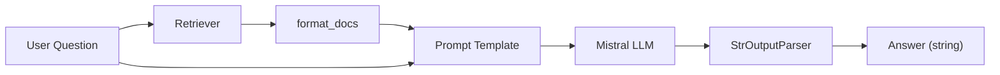
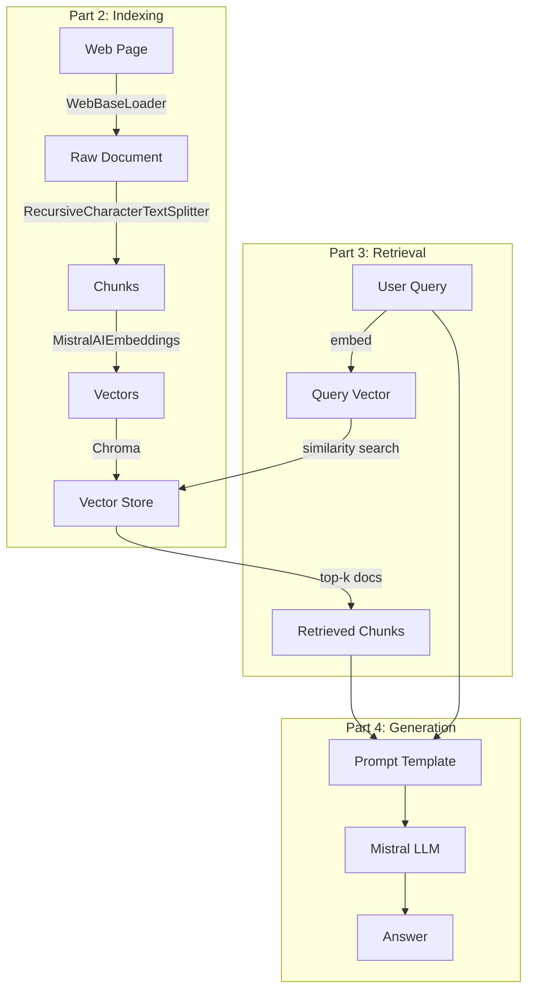

# RAG Tutorial – Parts 1–4 Walkthrough

> Line-by-line explanation of [`part_1_4.ipynb`](file:///c:/Users/abdel/OneDrive/Desktop/rag_tutorial/src/part_1_4.ipynb)

---

## 📚 References (Cell 1 – Markdown)

Links to the official LangChain documentation and Python API reference.

---

## ⚙️ Environment Initialization (Cell 2 – Code)

```python
import warnings
import os
from dotenv import load_dotenv
```

| Line                             | What it does                                         |
| -------------------------------- | ---------------------------------------------------- |
| `import warnings`                | Built-in module to control warning messages          |
| `import os`                      | Built-in module for environment variable access      |
| `from dotenv import load_dotenv` | Loads variables from a `.env` file into `os.environ` |

```python
warnings.filterwarnings("ignore")
```

Suppresses all Python warnings so the output stays clean.

```python
load_dotenv()
```

Reads `.env` file in the project root and loads its key-value pairs into environment variables.

```python
try:
    os.environ["LANGCHAIN_TRACING_V2"] = os.getenv("LANGSMITH_TRACING_V2")
    os.environ["LANGCHAIN_API_KEY"]    = os.getenv("LANGSMITH_API_KEY")
    os.environ["LANGCHAIN_PROJECT"]    = os.getenv("LANGSMITH_PROJECT")
    os.environ["LANGCHAIN_ENDPOINT"]   = os.getenv("LANGSMITH_ENDPOINT")
    os.environ["MISTRAL_API_KEY"]      = os.getenv("MISTRAL_API_KEY")
    os.environ["HF_TOKEN"]             = os.getenv("HF_TOKEN")
    os.environ["USER_AGENT"]           = "MyLangChainApp/1.0"
    print("Environment variables set successfully")
except Exception as e:
    print(f"Error: {e}")
```

| Variable               | Purpose                                           |
| ---------------------- | ------------------------------------------------- |
| `LANGCHAIN_TRACING_V2` | Enables **LangSmith** tracing (observability)     |
| `LANGCHAIN_API_KEY`    | API key to authenticate with LangSmith            |
| `LANGCHAIN_PROJECT`    | LangSmith project name to group traces            |
| `LANGCHAIN_ENDPOINT`   | LangSmith API endpoint URL                        |
| `MISTRAL_API_KEY`      | API key for the **Mistral AI** LLM & embeddings   |
| `HF_TOKEN`             | API token for **Hugging Face** model access       |
| `USER_AGENT`           | Required header for `WebBaseLoader` HTTP requests |

> The entire setup is wrapped in a **`try/except`** block — if any environment variable is missing or an error occurs, it prints the error message instead of crashing the notebook. This is a defensive pattern: fail gracefully and tell the developer what went wrong.

---

## 🧩 Part 1: Overview – Full RAG Pipeline (Cell 3 – Code)

### What is RAG (Retrieval-Augmented Generation)?

RAG is a technique that **grounds LLM responses in real data** instead of relying solely on the model's training knowledge. Without RAG, an LLM can only answer from what it memorized during training — which may be outdated, incomplete, or hallucinated. RAG solves this by **retrieving relevant documents** from a knowledge base and feeding them to the LLM as context.

**The RAG pipeline has 3 core stages:**

1. **Indexing** — Load documents, split them into chunks, embed them into vectors, and store in a vector database.
2. **Retrieval** — When a user asks a question, embed the question and find the most similar document chunks in the vector database.
3. **Generation** — Pass the retrieved chunks + the question to an LLM, which generates an answer grounded in the actual documents.

**Why RAG matters:**

- **Reduces hallucination** — The LLM answers based on real documents, not guesses.
- **Always up-to-date** — You can update the knowledge base without retraining the model.
- **Domain-specific** — Works with your own private data (company docs, research papers, etc.).
- **Verifiable** — You can trace which documents the answer came from.

This cell builds the **complete pipeline** end-to-end in one shot.

### Imports

```python
import bs4
from langchain_text_splitters import RecursiveCharacterTextSplitter
from langchain_community.document_loaders import WebBaseLoader
from langchain_community.vectorstores import Chroma
from langchain_core.output_parsers import StrOutputParser
from langchain_core.runnables import RunnablePassthrough
from langchain_mistralai import ChatMistralAI, MistralAIEmbeddings
from langsmith import Client
client = Client()
```

| Import                           | Role                                                          |
| -------------------------------- | ------------------------------------------------------------- |
| `bs4`                            | **BeautifulSoup** – parses HTML to extract specific content   |
| `RecursiveCharacterTextSplitter` | Splits long documents into smaller chunks                     |
| `WebBaseLoader`                  | Fetches and loads web page content                            |
| `Chroma`                         | Vector database for storing and querying embeddings           |
| `StrOutputParser`                | Extracts plain text from the LLM response                     |
| `RunnablePassthrough`            | Passes input through unchanged (used to forward the question) |
| `ChatMistralAI`                  | Mistral AI chat model wrapper                                 |
| `MistralAIEmbeddings`            | Mistral AI embeddings model wrapper                           |
| `Client` (LangSmith)             | Client to interact with LangSmith (pull prompts, tracing)     |

> **`client = Client()`** creates a LangSmith client instance. This object is your gateway to the LangSmith platform — it lets you **pull community prompts** (like `rlm/rag-prompt`), **push traces**, and **manage datasets**. It reads `LANGCHAIN_API_KEY` and `LANGCHAIN_ENDPOINT` from the environment variables set above.

### Step 1 – Load Documents

```python
loader = WebBaseLoader(
    web_paths=["https://lilianweng.github.io/posts/2023-06-23-agent/"],
    bs_kwargs=dict(
        parse_only=bs4.SoupStrainer(
            class_=("post-content", "post-title", "author")
        )
    ),
)
docs = loader.load()
```

- Fetches the blog post about **LLM-powered Autonomous Agents**.
- `SoupStrainer` filters the HTML to keep only elements with class `post-content`, `post-title`, or `author` — ignoring nav, sidebar, footer, etc.
- `docs` is a list of `Document` objects each containing `page_content` and `metadata`.

### Step 2 – Split into Chunks

```python
text_splitter = RecursiveCharacterTextSplitter(
    chunk_size=1000,
    chunk_overlap=200,
)
splits = text_splitter.split_documents(docs)
```

- **`chunk_size=1000`**: Each chunk ≤ 1000 characters.
- **`chunk_overlap=200`**: Adjacent chunks share 200 characters to preserve context at boundaries.
- Splits recursively by `\n\n` → `\n` → ` ` → character to keep paragraphs intact.

### Step 3 – Embed & Store

```python
vectorstore = Chroma.from_documents(
    documents=splits,
    embedding=MistralAIEmbeddings(model="mistral-embed"),
    collection_name="Tutorial",
    persist_directory="../db"
)
```

- Each chunk is **embedded** (converted to a 1024-dim vector) using Mistral's `mistral-embed` model.
- Vectors are stored in a **Chroma** database persisted to `../db`.
- `collection_name="Tutorial"` names this collection inside the DB.

### Step 4 – Create Retriever

```python
retriever = vectorstore.as_retriever()
```

Creates a retriever interface that, given a query, returns the most similar document chunks (default **k=4**).

### Step 5 – Pull Prompt from LangSmith Hub

```python
prompt = client.pull_prompt("rlm/rag-prompt")
```

Pulls the community RAG prompt template `rlm/rag-prompt` from LangSmith Hub. This prompt has `{context}` and `{question}` placeholders.

### Step 6 – Initialize LLM

```python
llm = ChatMistralAI(model="mistral-medium-latest", temperature=0)
```

- **`mistral-medium-latest`**: A mid-tier Mistral model (good balance of quality and speed).
- **`temperature=0`**: Deterministic output (no randomness).

### Step 7 – Post-processing Helper

```python
def format_docs(docs):
    return "\n\n".join(doc.page_content for doc in docs)
```

Takes a list of retrieved `Document` objects and concatenates their text with double newlines — converting them into a single string to pass as `{context}`.

### Step 8 – Build & Run the RAG Chain

```python
rag_chain = (
    {"context": retriever | format_docs, "question": RunnablePassthrough()}
    | prompt
    | llm
    | StrOutputParser()
)

rag_chain.invoke("what is Task Decomposition?")
```

**Data flow (LCEL – LangChain Expression Language):**



1. The question is sent to the **retriever** → retrieves top-k docs → `format_docs` turns them into a string → fills `{context}`.
2. The question also passes through via `RunnablePassthrough()` → fills `{question}`.
3. The filled prompt goes to the **LLM** → response is parsed to a plain string.

---

## 📑 Part 2: Indexing – Deep Dive (Cells 4–9)

### What is Indexing?

Indexing is the **preparation phase** of RAG — it happens before any user query. The goal is to transform raw documents into a searchable format that allows fast, semantic retrieval.

**The indexing pipeline has 4 steps:**

1. **Load** — Fetch the raw content from a source (web page, PDF, database, etc.).
2. **Split** — Break the content into smaller chunks. LLMs have limited context windows, and smaller chunks also lead to more precise retrieval.
3. **Embed** — Convert each text chunk into a numerical vector (a list of numbers) that captures its semantic meaning. Texts with similar meanings produce vectors that are close together.
4. **Store** — Save the vectors in a vector database (like ChromaDB) that supports fast similarity search.

**Why chunking matters:** If you embed an entire 10,000-word document as one vector, it captures the _average_ meaning of everything — making it hard to match specific questions. Smaller chunks (300–1000 tokens) capture focused topics, so retrieval is more precise.

**Why overlap matters:** When you split text, you might cut a sentence in half. Overlap (e.g., 50 tokens shared between adjacent chunks) ensures important context at chunk boundaries isn't lost.

This section dives deep into each step with hands-on examples — tokenization, embedding, cosine similarity, and vector storage.

### Cell 4 – Define Sample Data

```python
question = "What kinds of pets do I like?"
document = "My favorite pet is cat."
```

Simple question-document pair used to demonstrate **tokenization** and **embeddings**.

---

### Cell 5 – Token Counting

```python
import tiktoken

def num_tokens_from_string(string: str, encoding_name: str) -> int:
    encoding = tiktoken.get_encoding(encoding_name)
    num_tokens = len(encoding.encode(string))
    return num_tokens

num_of_tokens = num_tokens_from_string(question, "cl100k_base")
```

- **`tiktoken`**: OpenAI's fast tokenizer library.
- **`cl100k_base`**: The encoding used by GPT-4 / text-embedding-ada-002. Used here to understand how text tokenizes.
- Returns **8** tokens for `"What kinds of pets do I like?"`.

> **Why this matters**: Embedding models and LLMs have token limits. Understanding token counts helps you size chunks correctly.

---

### Cell 6 – Generate Embeddings

```python
embed = MistralAIEmbeddings(model="mistral-embed")
query_result = embed.embed_query(question)
doc_result = embed.embed_query(document)

len(query_result)  # → 1024
```

- Converts both the question and document into **1024-dimensional float vectors**.
- These vectors capture **semantic meaning** — similar meanings produce similar vectors.

---

### Cell 7 – Cosine Similarity

```python
import numpy as np

def cosine_similarity(vec1, vec2):
    dot_product = np.dot(vec1, vec2)
    norm_vec1 = np.linalg.norm(vec1)
    norm_vec2 = np.linalg.norm(vec2)
    return dot_product / (norm_vec1 * norm_vec2)

similarity_result = cosine_similarity(query_result, doc_result)
print(similarity_result)  # → 0.7559
```

- **Cosine similarity** measures the angle between two vectors (1.0 = identical, 0 = orthogonal).
- **0.756** indicates the question and document are **semantically related** (both about pets).
- This is the same math the vector DB uses under the hood to find relevant documents.

---

### Cell 8 – Load Blog Post (Again)

```python
loader = WebBaseLoader(
    web_paths=["https://lilianweng.github.io/posts/2023-06-23-agent/"],
    bs_kwargs=dict(
        parse_only=bs4.SoupStrainer(
            class_=("post-content", "post-title", "author")
        )
    ),
)
blog_docs = loader.load()
```

Same loader as Part 1, but stores results in `blog_docs` for the next steps.

---

### Cell 9 – Splitting with Token-based Sizing

```python
text_splitter = RecursiveCharacterTextSplitter.from_tiktoken_encoder(
    chunk_size=300,
    chunk_overlap=50,
)
splits = text_splitter.split_documents(blog_docs)
```

| Parameter       | Value | Meaning                                        |
| --------------- | ----- | ---------------------------------------------- |
| `chunk_size`    | 300   | Max **300 tokens** per chunk (not characters!) |
| `chunk_overlap` | 50    | 50 tokens of overlap between adjacent chunks   |

- **`from_tiktoken_encoder`** – uses actual token counts instead of character counts for more accurate sizing.
- Smaller chunks (300 tokens) = more precise retrieval but more chunks to store.

---

### Cell 10 – Store in Chroma (Blog Collection)

```python
embeddings = MistralAIEmbeddings(model="mistral-embed")

vStore = Chroma.from_documents(
    splits,
    embedding=embeddings,
    collection_name="blog_posts",
    persist_directory="../db_blog",
)

retriever = vStore.as_retriever()
```

- Creates a **separate** Chroma collection `"blog_posts"` persisted to `../db_blog`.
- Creates a retriever from this new store.

---

## 🔍 Part 3: Retrieval (Cell 11)

### What is Retrieval?

Retrieval is the **runtime phase** of RAG — it happens every time a user asks a question. The goal is to find the most relevant document chunks from the vector database to use as context for the LLM.

**How it works:**

1. The user's question is **embedded** into a vector using the same embedding model used during indexing.
2. The vector database performs a **similarity search** — comparing the question vector against all stored document vectors.
3. The **top-k** most similar chunks are returned (e.g., `k=1` returns the single best match, `k=4` returns the top 4).

**Similarity search under the hood:** The database uses **cosine similarity** (or similar distance metrics) to measure how "close" two vectors are. Vectors pointing in the same direction (similar meaning) have a cosine similarity near 1.0; orthogonal vectors (unrelated meaning) have similarity near 0.

**Why `k` matters:**

- **Too small** (`k=1`): You might miss relevant context — the best chunk may not contain everything needed.
- **Too large** (`k=10+`): You include noisy, less relevant chunks that can confuse the LLM or exceed its context window.
- **Sweet spot**: `k=3` to `k=5` is common in practice.

> In this cell, `k=1` is used for demonstration purposes.

```python
embeddings = MistralAIEmbeddings(model="mistral-embed")

vStore = Chroma(
    persist_directory="../db_blog",
    embedding_function=embeddings,
    collection_name="blog_posts",
)

retriever = vStore.as_retriever(search_kwargs={"k": 1})
docs = retriever.invoke("what is Task Decomposition?")
len(docs)  # → 1
```

| Concept                  | Explanation                                                          |
| ------------------------ | -------------------------------------------------------------------- |
| `Chroma(...)`            | **Loads** an existing persisted Chroma DB (no `from_documents`)      |
| `search_kwargs={"k": 1}` | Returns only the **top 1** most similar document                     |
| `retriever.invoke(...)`  | Embeds the query → searches the vector store → returns matching docs |

> **Note**: `k=1` is used here for demo purposes. In production, `k=3` or `k=4` is more common.

---

## 💬 Part 4: Generation (Cells 12–13)

### What is Generation?

Generation is the **final stage** of RAG — where the LLM produces a human-readable answer using the retrieved documents as context. Without this stage, you'd just have a search engine returning raw document chunks. Generation transforms those chunks into a coherent, direct answer to the user's question.

**How it works:**

1. The retrieved document chunks are inserted into a **prompt template** as `{context}`.
2. The user's question is inserted as `{question}`.
3. The filled prompt is sent to the LLM, which generates an answer **grounded in the provided context**.
4. The response is parsed into a plain string.

**The prompt is critical:** The prompt template instructs the LLM to answer **based only on the provided context**. This constraint is what prevents hallucination — the LLM should not make up information that isn't in the retrieved documents.

**Two approaches shown here:**

- **Cell 12**: Uses a custom prompt template and passes **entire raw documents** as context (no retriever) — useful for testing the prompt + LLM in isolation.
- **Cell 13**: Uses a community RAG prompt from LangSmith Hub and connects it to the **full pipeline** (retriever → prompt → LLM → output parser).

**Temperature = 0:** The LLM is set to `temperature=0` for deterministic output — given the same context and question, it always produces the same answer. This is important for reproducibility and consistency in RAG applications.

### Cell 12 – Custom Prompt Template

```python
from langchain_mistralai import ChatMistralAI
from langchain_core.prompts import ChatPromptTemplate
from langchain_core.output_parsers import StrOutputParser

template = """Answer the question based only on the following context:
{context}

Question: {question}
"""

prompt = ChatPromptTemplate.from_template(template)
```

- Defines a **custom prompt** that instructs the LLM to answer **only** from the provided context (no hallucination).
- `{context}` – filled with retrieved documents.
- `{question}` – filled with the user's question.

### Cell 12 continued – Simple Chain (no retriever)

```python
llm = ChatMistralAI(model="mistral-medium-latest", temperature=0)

chain = prompt | llm | StrOutputParser()

result = chain.invoke({"context": blog_docs, "question": "What is Task Decomposition?"})
print(result)
```

- **No retriever** here — passes the **entire** `blog_docs` as context directly.
- Useful for testing the prompt + LLM without retrieval.

---

### Cell 13 – Full RAG Chain with LangSmith Prompt

```python
from langsmith import Client
client = Client()
prompt_temp = client.pull_prompt("rlm/rag-prompt")
```

| Line | What it does |
| ---- | ------------ |
| `Client()` | Creates a LangSmith client (reads API key from env) |
| `client.pull_prompt("rlm/rag-prompt")` | Downloads the **community RAG prompt** `rlm/rag-prompt` from LangSmith Hub — a battle-tested template with `{context}` and `{question}` placeholders |

```python
rag_chain = (
    {"context": retriever | format_docs, "question": RunnablePassthrough()}
    | prompt_temp
    | llm
    | StrOutputParser()
)

print(rag_chain.invoke("What is Task Decomposition?"))
```

| Step | What happens |
| ---- | ------------ |
| `retriever \| format_docs` | The question is sent to the retriever → top-k documents are returned → `format_docs` joins their `page_content` with `\n\n` → fills `{context}` |
| `RunnablePassthrough()` | Forwards the raw question string unchanged → fills `{question}` |
| `prompt_temp` | The LangSmith Hub prompt combines context + question into a structured message |
| `llm` | Mistral LLM generates an answer grounded in the retrieved context |
| `StrOutputParser()` | Extracts the response as a plain string |

> **How this differs from Cell 12:** Cell 12 passed the **entire raw document** as context (no retriever). This cell uses the **retriever** to find only the most relevant chunks first — this is the "real" RAG pattern you'd use in production.

> ⚠️ **Note**: The notebook version uses `retriever` directly without `format_docs`. LangChain will auto-format the documents, but applying `format_docs` (as shown in Part 1) gives you explicit control over how context is formatted for the LLM.

---

## 🗺️ Overall Architecture



---

## 📦 Key Dependencies

| Package                    | Purpose                                         |
| -------------------------- | ----------------------------------------------- |
| `langchain-core`           | Core abstractions (prompts, parsers, runnables) |
| `langchain-community`      | Community integrations (Chroma, WebBaseLoader)  |
| `langchain-text-splitters` | Document splitting utilities                    |
| `langchain-mistralai`      | Mistral AI LLM & embedding wrappers             |
| `langsmith`                | Observability, tracing, prompt hub              |
| `chromadb`                 | Vector database                                 |
| `beautifulsoup4`           | HTML parsing                                    |
| `tiktoken`                 | Token counting                                  |
| `python-dotenv`            | `.env` file loading                             |
| `numpy`                    | Numerical operations (cosine similarity)        |

---

## ✅ Best Practices for a Professional RAG Pipeline

### 🔐 Environment & Configuration

| Practice                                                          | Why                                                      |
| ----------------------------------------------------------------- | -------------------------------------------------------- |
| **Never hardcode API keys** — always use `.env` + `python-dotenv` | Avoids leaking secrets in version control                |
| **Add `.env` to `.gitignore`** immediately                        | Prevents accidental commits of credentials               |
| **Provide a `.env.example`** with placeholder values              | Helps new team members set up quickly                    |
| **Validate env vars on startup** — fail fast with clear errors    | Catches missing keys before running expensive operations |
| **Use `warnings.filterwarnings("ignore")` only in notebooks**     | In production, log warnings instead of suppressing them  |

### 📄 Document Loading

| Practice                                                                    | Why                                                              |
| --------------------------------------------------------------------------- | ---------------------------------------------------------------- |
| **Always filter HTML with `SoupStrainer`**                                  | Removes noise (nav, footer, sidebar) that pollutes embeddings    |
| **Log document counts after loading** — `print(f"Loaded {len(docs)} docs")` | Catches empty loads early (e.g., page structure changed)         |
| **Store raw documents as backup** before splitting                          | Allows re-splitting with different params without re-downloading |
| **Handle loading errors gracefully** — wrap in `try/except`                 | Web sources can be unreliable; don't crash the whole pipeline    |
| **Set a `USER_AGENT` header** for web loaders                               | Many sites block requests without a user agent                   |

### ✂️ Chunking Strategy

| Practice                                                                                          | Why                                                               |
| ------------------------------------------------------------------------------------------------- | ----------------------------------------------------------------- |
| **Use token-based chunking** (`from_tiktoken_encoder`) over character-based                       | Token limits are what matter for LLMs; 300 chars ≠ 300 tokens     |
| **Experiment with chunk sizes** — 300-500 tokens for precise retrieval, 1000+ for broader context | There's no universal best size; it depends on your data           |
| **Always use overlap** (50-200 tokens)                                                            | Prevents losing context at chunk boundaries                       |
| **Print chunk count and sample chunks** after splitting                                           | Validates that splitting worked as expected                       |
| **Keep metadata** — source URL, chunk index, section title                                        | Enables traceability: "Which document did this answer come from?" |

### 🧮 Embeddings

| Practice                                                           | Why                                                       |
| ------------------------------------------------------------------ | --------------------------------------------------------- |
| **Use the same embedding model** for indexing and querying         | Mismatched models produce incompatible vector spaces      |
| **Understand your model's dimension** (e.g., Mistral = 1024-dim)   | Affects storage costs and retrieval speed                 |
| **Test with cosine similarity** before building the full pipeline  | Validates that your embeddings capture semantic relevance |
| **Batch embed** instead of one-by-one when indexing large datasets | Much faster; reduces API calls and latency                |
| **Cache embeddings** — don't re-embed unchanged documents          | Saves time and API costs on re-indexing                   |

### 🗄️ Vector Store

| Practice                                                                           | Why                                                                |
| ---------------------------------------------------------------------------------- | ------------------------------------------------------------------ |
| **Always set `persist_directory`** for ChromaDB                                    | Without persistence, you lose everything when Python exits         |
| **Use meaningful `collection_name`** values                                        | Helps organize multiple projects/datasets in one DB                |
| **Load existing stores with `Chroma()`** — not `Chroma.from_documents()`           | `from_documents()` re-indexes everything; `Chroma()` just connects |
| **Monitor collection count** — `vectorstore._collection.count()`                   | Detects empty or corrupted stores before querying                  |
| **Plan for scale** — consider cloud vector DBs (Pinecone, Weaviate) for production | ChromaDB is great for development; production may need more        |

### 🔍 Retrieval

| Practice                                                                | Why                                                            |
| ----------------------------------------------------------------------- | -------------------------------------------------------------- |
| **Start with `k=3` to `k=5`** as default                                | Balances coverage vs. noise; adjust based on results           |
| **Always test retrieval before generation** — check what docs come back | Bad retrieval = bad answers, regardless of how good the LLM is |
| **Log retrieved document sources** for debugging                        | Makes it easy to trace "why did the LLM say this?"             |
| **Consider MMR (Maximum Marginal Relevance)** over plain similarity     | MMR adds diversity — avoids retrieving 3 near-identical chunks |

### 💬 Prompt Engineering

| Practice                                                                               | Why                                                        |
| -------------------------------------------------------------------------------------- | ---------------------------------------------------------- |
| **Include "answer only from the context" constraint**                                  | The #1 defense against hallucination                       |
| **Use LangSmith Hub prompts as starting points**                                       | Community-tested templates save time                       |
| **Version your prompts** — store them in files or LangSmith                            | Prompt changes affect output quality; track them like code |
| **Test prompts with edge cases** — no context, irrelevant context, conflicting context | Reveals failure modes before users do                      |

### 🔗 Chain Design (LCEL)

| Practice                                                          | Why                                                            |
| ----------------------------------------------------------------- | -------------------------------------------------------------- |
| **Set `temperature=0`** for factual RAG tasks                     | Deterministic output; same question → same answer              |
| **Use `RunnablePassthrough()`** to forward inputs through chains  | Clean way to pass the question alongside retrieved context     |
| **Use `format_docs()`** to control context formatting             | Gives you control over what the LLM sees (vs. auto-formatting) |
| **Enable LangSmith tracing** in development                       | Visualize every step of the chain — invaluable for debugging   |
| **Test components individually** before assembling the full chain | Debug retrieval, prompt, and generation separately             |
