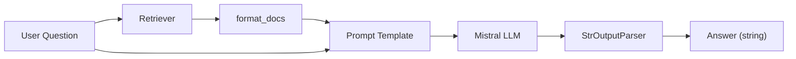
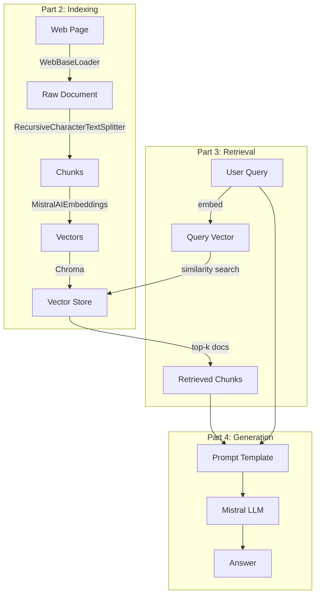

# RAG Tutorial – Parts 1–4 Walkthrough

> Line-by-line explanation of [`part_1_4.ipynb`](file:///c:/Users/abdel/OneDrive/Desktop/rag_tutorial/src/part_1_4.ipynb)

---

## 📚 References (Cell 1 – Markdown)

Links to the official LangChain documentation and Python API reference.

---

## ⚙️ Environment Initialization (Cell 2 – Code)

```python
import warnings
import os
from dotenv import load_dotenv
```

| Line                             | What it does                                         |
| -------------------------------- | ---------------------------------------------------- |
| `import warnings`                | Built-in module to control warning messages          |
| `import os`                      | Built-in module for environment variable access      |
| `from dotenv import load_dotenv` | Loads variables from a `.env` file into `os.environ` |

```python
warnings.filterwarnings("ignore")
```

Suppresses all Python warnings so the output stays clean.

```python
load_dotenv()
```

Reads `.env` file in the project root and loads its key-value pairs into environment variables.

```python
os.environ["LANGCHAIN_TRACING_V2"] = os.getenv("LANGSMITH_TRACING_V2")
os.environ["LANGCHAIN_API_KEY"]    = os.getenv("LANGSMITH_API_KEY")
os.environ["LANGCHAIN_PROJECT"]    = os.getenv("LANGSMITH_PROJECT")
os.environ["LANGCHAIN_ENDPOINT"]   = os.getenv("LANGSMITH_ENDPOINT")
os.environ["MISTRAL_API_KEY"]      = os.getenv("MISTRAL_API_KEY")
os.environ["USER_AGENT"]           = "MyLangChainApp/1.0"
```

| Variable               | Purpose                                           |
| ---------------------- | ------------------------------------------------- |
| `LANGCHAIN_TRACING_V2` | Enables **LangSmith** tracing (observability)     |
| `LANGCHAIN_API_KEY`    | API key to authenticate with LangSmith            |
| `LANGCHAIN_PROJECT`    | LangSmith project name to group traces            |
| `LANGCHAIN_ENDPOINT`   | LangSmith API endpoint URL                        |
| `MISTRAL_API_KEY`      | API key for the **Mistral AI** LLM & embeddings   |
| `USER_AGENT`           | Required header for `WebBaseLoader` HTTP requests |

> The `try/except` block catches any errors during setup and prints them.

---

## 🧩 Part 1: Overview – Full RAG Pipeline (Cell 3 – Code)

This cell builds a **complete RAG chain** end-to-end in one shot.

### Imports

```python
import bs4
from langchain_text_splitters import RecursiveCharacterTextSplitter
from langchain_community.document_loaders import WebBaseLoader
from langchain_community.vectorstores import Chroma
from langchain_core.output_parsers import StrOutputParser
from langchain_core.runnables import RunnablePassthrough
from langchain_mistralai import ChatMistralAI, MistralAIEmbeddings
from langsmith import Client
```

| Import                           | Role                                                          |
| -------------------------------- | ------------------------------------------------------------- |
| `bs4`                            | **BeautifulSoup** – parses HTML to extract specific content   |
| `RecursiveCharacterTextSplitter` | Splits long documents into smaller chunks                     |
| `WebBaseLoader`                  | Fetches and loads web page content                            |
| `Chroma`                         | Vector database for storing and querying embeddings           |
| `StrOutputParser`                | Extracts plain text from the LLM response                     |
| `RunnablePassthrough`            | Passes input through unchanged (used to forward the question) |
| `ChatMistralAI`                  | Mistral AI chat model wrapper                                 |
| `MistralAIEmbeddings`            | Mistral AI embeddings model wrapper                           |
| `Client` (LangSmith)             | Client to interact with LangSmith (pull prompts, tracing)     |

### Step 1 – Load Documents

```python
loader = WebBaseLoader(
    web_paths=["https://lilianweng.github.io/posts/2023-06-23-agent/"],
    bs_kwargs=dict(
        parse_only=bs4.SoupStrainer(
            class_=("post-content", "post-title", "author")
        )
    ),
)
docs = loader.load()
```

- Fetches the blog post about **LLM-powered Autonomous Agents**.
- `SoupStrainer` filters the HTML to keep only elements with class `post-content`, `post-title`, or `author` — ignoring nav, sidebar, footer, etc.
- `docs` is a list of `Document` objects each containing `page_content` and `metadata`.

### Step 2 – Split into Chunks

```python
text_splitter = RecursiveCharacterTextSplitter(
    chunk_size=1000,
    chunk_overlap=200,
)
splits = text_splitter.split_documents(docs)
```

- **`chunk_size=1000`**: Each chunk ≤ 1000 characters.
- **`chunk_overlap=200`**: Adjacent chunks share 200 characters to preserve context at boundaries.
- Splits recursively by `\n\n` → `\n` → ` ` → character to keep paragraphs intact.

### Step 3 – Embed & Store

```python
vectorstore = Chroma.from_documents(
    documents=splits,
    embedding=MistralAIEmbeddings(model="mistral-embed"),
    collection_name="Tutorial",
    persist_directory="../db"
)
```

- Each chunk is **embedded** (converted to a 1024-dim vector) using Mistral's `mistral-embed` model.
- Vectors are stored in a **Chroma** database persisted to `../db`.
- `collection_name="Tutorial"` names this collection inside the DB.

### Step 4 – Create Retriever

```python
retriever = vectorstore.as_retriever()
```

Creates a retriever interface that, given a query, returns the most similar document chunks (default **k=4**).

### Step 5 – Pull Prompt from LangSmith Hub

```python
prompt = client.pull_prompt("rlm/rag-prompt")
```

Pulls the community RAG prompt template `rlm/rag-prompt` from LangSmith Hub. This prompt has `{context}` and `{question}` placeholders.

### Step 6 – Initialize LLM

```python
llm = ChatMistralAI(model="mistral-medium-latest", temperature=0)
```

- **`mistral-medium-latest`**: A mid-tier Mistral model (good balance of quality and speed).
- **`temperature=0`**: Deterministic output (no randomness).

### Step 7 – Post-processing Helper

```python
def format_docs(docs):
    return "\n\n".join(doc.page_content for doc in docs)
```

Takes a list of retrieved `Document` objects and concatenates their text with double newlines — converting them into a single string to pass as `{context}`.

### Step 8 – Build & Run the RAG Chain

```python
rag_chain = (
    {"context": retriever | format_docs, "question": RunnablePassthrough()}
    | prompt
    | llm
    | StrOutputParser()
)

rag_chain.invoke("what is Task Decomposition?")
```

**Data flow (LCEL – LangChain Expression Language):**



1. The question is sent to the **retriever** → retrieves top-k docs → `format_docs` turns them into a string → fills `{context}`.
2. The question also passes through via `RunnablePassthrough()` → fills `{question}`.
3. The filled prompt goes to the **LLM** → response is parsed to a plain string.

---

## 📑 Part 2: Indexing – Deep Dive (Cells 4–9)

### Cell 4 – Define Sample Data

```python
question = "What kinds of pets do I like?"
document = "My favorite pet is cat."
```

Simple question-document pair used to demonstrate **tokenization** and **embeddings**.

---

### Cell 5 – Token Counting

```python
import tiktoken

def num_tokens_from_string(string: str, encoding_name: str) -> int:
    encoding = tiktoken.get_encoding(encoding_name)
    num_tokens = len(encoding.encode(string))
    return num_tokens

num_of_tokens = num_tokens_from_string(question, "cl100k_base")
```

- **`tiktoken`**: OpenAI's fast tokenizer library.
- **`cl100k_base`**: The encoding used by GPT-4 / text-embedding-ada-002. Used here to understand how text tokenizes.
- Returns **8** tokens for `"What kinds of pets do I like?"`.

> **Why this matters**: Embedding models and LLMs have token limits. Understanding token counts helps you size chunks correctly.

---

### Cell 6 – Generate Embeddings

```python
embed = MistralAIEmbeddings(model="mistral-embed")
query_result = embed.embed_query(question)
doc_result = embed.embed_query(document)

len(query_result)  # → 1024
```

- Converts both the question and document into **1024-dimensional float vectors**.
- These vectors capture **semantic meaning** — similar meanings produce similar vectors.

---

### Cell 7 – Cosine Similarity

```python
import numpy as np

def cosine_similarity(vec1, vec2):
    dot_product = np.dot(vec1, vec2)
    norm_vec1 = np.linalg.norm(vec1)
    norm_vec2 = np.linalg.norm(vec2)
    return dot_product / (norm_vec1 * norm_vec2)

similarity_result = cosine_similarity(query_result, doc_result)
print(similarity_result)  # → 0.7559
```

- **Cosine similarity** measures the angle between two vectors (1.0 = identical, 0 = orthogonal).
- **0.756** indicates the question and document are **semantically related** (both about pets).
- This is the same math the vector DB uses under the hood to find relevant documents.

---

### Cell 8 – Load Blog Post (Again)

```python
loader = WebBaseLoader(
    web_paths=["https://lilianweng.github.io/posts/2023-06-23-agent/"],
    bs_kwargs=dict(
        parse_only=bs4.SoupStrainer(
            class_=("post-content", "post-title", "author")
        )
    ),
)
blog_docs = loader.load()
```

Same loader as Part 1, but stores results in `blog_docs` for the next steps.

---

### Cell 9 – Splitting with Token-based Sizing

```python
text_splitter = RecursiveCharacterTextSplitter.from_tiktoken_encoder(
    chunk_size=300,
    chunk_overlap=50,
)
splits = text_splitter.split_documents(blog_docs)
```

| Parameter       | Value | Meaning                                        |
| --------------- | ----- | ---------------------------------------------- |
| `chunk_size`    | 300   | Max **300 tokens** per chunk (not characters!) |
| `chunk_overlap` | 50    | 50 tokens of overlap between adjacent chunks   |

- **`from_tiktoken_encoder`** – uses actual token counts instead of character counts for more accurate sizing.
- Smaller chunks (300 tokens) = more precise retrieval but more chunks to store.

---

### Cell 10 – Store in Chroma (Blog Collection)

```python
embeddings = MistralAIEmbeddings(model="mistral-embed")

vStore = Chroma.from_documents(
    splits,
    embedding=embeddings,
    collection_name="blog_posts",
    persist_directory="../db_blog",
)

retriever = vStore.as_retriever()
```

- Creates a **separate** Chroma collection `"blog_posts"` persisted to `../db_blog`.
- Creates a retriever from this new store.

---

## 🔍 Part 3: Retrieval (Cell 11)

```python
embeddings = MistralAIEmbeddings(model="mistral-embed")

vStore = Chroma(
    persist_directory="../db_blog",
    embedding_function=embeddings,
    collection_name="blog_posts",
)

retriever = vStore.as_retriever(search_kwargs={"k": 1})
docs = retriever.invoke("what is Task Decomposition?")
len(docs)  # → 1
```

| Concept                  | Explanation                                                          |
| ------------------------ | -------------------------------------------------------------------- |
| `Chroma(...)`            | **Loads** an existing persisted Chroma DB (no `from_documents`)      |
| `search_kwargs={"k": 1}` | Returns only the **top 1** most similar document                     |
| `retriever.invoke(...)`  | Embeds the query → searches the vector store → returns matching docs |

> **Note**: `k=1` is used here for demo purposes. In production, `k=3` or `k=4` is more common.

---

## 💬 Part 4: Generation (Cells 12–13)

### Cell 12 – Custom Prompt Template

```python
from langchain_mistralai import ChatMistralAI
from langchain_core.prompts import ChatPromptTemplate
from langchain_core.output_parsers import StrOutputParser

template = """Answer the question based only on the following context:
{context}

Question: {question}
"""

prompt = ChatPromptTemplate.from_template(template)
```

- Defines a **custom prompt** that instructs the LLM to answer **only** from the provided context (no hallucination).
- `{context}` – filled with retrieved documents.
- `{question}` – filled with the user's question.

### Cell 12 continued – Simple Chain (no retriever)

```python
llm = ChatMistralAI(model="mistral-medium-latest", temperature=0)

chain = prompt | llm | StrOutputParser()

result = chain.invoke({"context": blog_docs, "question": "What is Task Decomposition?"})
print(result)
```

- **No retriever** here — passes the **entire** `blog_docs` as context directly.
- Useful for testing the prompt + LLM without retrieval.

---

### Cell 13 – Full RAG Chain with LangSmith Prompt

```python
from langsmith import Client
client = Client()
prompt_temp = client.pull_prompt("rlm/rag-prompt")

rag_chain = (
    {"context": retriever, "question": RunnablePassthrough()}
    | prompt_temp
    | llm
    | StrOutputParser()
)

print(rag_chain.invoke("What is Task Decomposition?"))
```

- Pulls the **community RAG prompt** from LangSmith Hub.
- Builds a full RAG chain: **retriever → prompt → LLM → string output**.

> ⚠️ **Note**: Unlike Part 1, the `format_docs` function is **not** applied to the retriever output here. LangChain will auto-format the documents, but using `format_docs` gives you more control over how context is formatted.

---

## 🗺️ Overall Architecture



---

## 📦 Key Dependencies

| Package                    | Purpose                                         |
| -------------------------- | ----------------------------------------------- |
| `langchain-core`           | Core abstractions (prompts, parsers, runnables) |
| `langchain-community`      | Community integrations (Chroma, WebBaseLoader)  |
| `langchain-text-splitters` | Document splitting utilities                    |
| `langchain-mistralai`      | Mistral AI LLM & embedding wrappers             |
| `langsmith`                | Observability, tracing, prompt hub              |
| `chromadb`                 | Vector database                                 |
| `beautifulsoup4`           | HTML parsing                                    |
| `tiktoken`                 | Token counting                                  |
| `python-dotenv`            | `.env` file loading                             |
| `numpy`                    | Numerical operations (cosine similarity)        |
