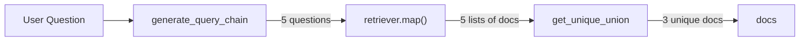
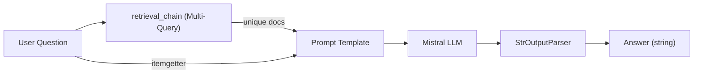
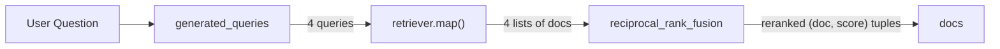
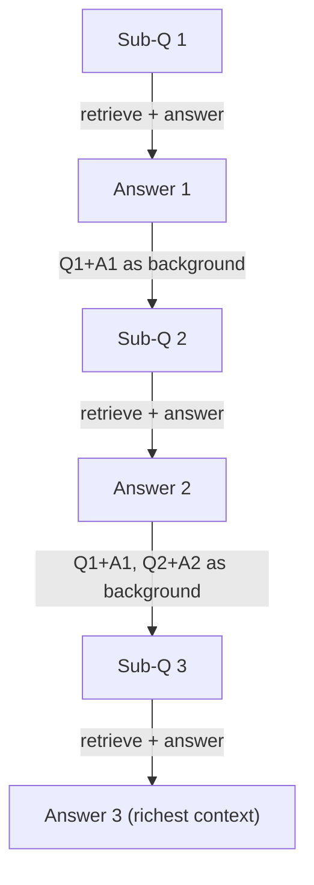
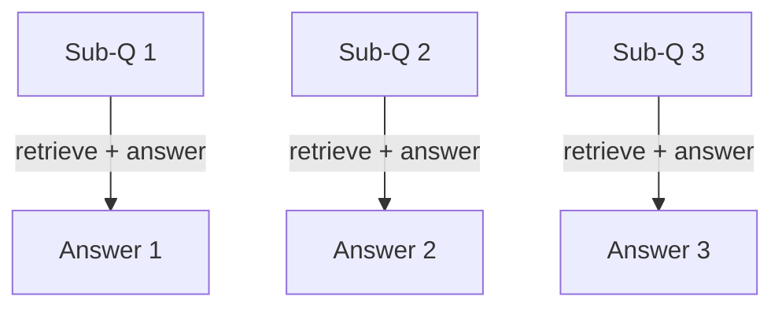
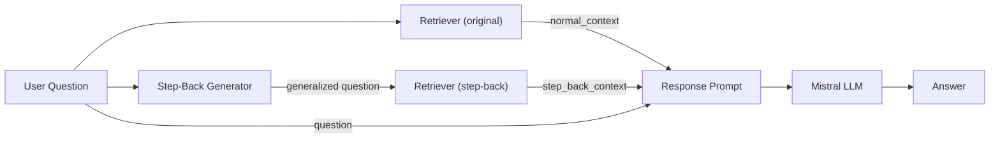
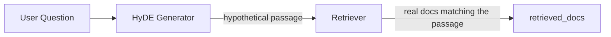

# RAG From Scratch – Parts 5–9 Walkthrough

> Line-by-line explanation of [`part_5_9.ipynb`](file:///c:/Users/abdel/OneDrive/Desktop/rag_tutorial/src/part_5_9/part_5_9.ipynb)

---

## ⚙️ Environment Initialization (Cell 1 – Code)

### Imports

```python
import warnings
import os
from dotenv import load_dotenv
```

| Import                           | Role                                                 |
| -------------------------------- | ---------------------------------------------------- |
| `warnings`                       | Built-in module to control warning messages          |
| `os`                             | Built-in module for environment variable access      |
| `from dotenv import load_dotenv` | Loads variables from a `.env` file into `os.environ` |

```python
warnings.filterwarnings("ignore")
```

Suppresses all Python warnings so the output stays clean.

```python
load_dotenv()
```

Reads the `.env` file in the project root and loads its key-value pairs into environment variables.

```python
os.environ["LANGCHAIN_TRACING_V2"] = os.getenv("LANGSMITH_TRACING_V2")
os.environ["LANGCHAIN_API_KEY"]    = os.getenv("LANGSMITH_API_KEY")
os.environ["LANGCHAIN_PROJECT"]    = os.getenv("LANGSMITH_PROJECT")
os.environ["LANGCHAIN_ENDPOINT"]   = os.getenv("LANGSMITH_ENDPOINT")
os.environ["MISTRAL_API_KEY"]      = os.getenv("MISTRAL_API_KEY")
os.environ["HF_TOKEN"]             = os.getenv("HF_TOKEN")
os.environ["USER_AGENT"]           = "MyLangChainApp/1.0"
```

| Variable               | Purpose                                           |
| ---------------------- | ------------------------------------------------- |
| `LANGCHAIN_TRACING_V2` | Enables **LangSmith** tracing (observability)     |
| `LANGCHAIN_API_KEY`    | API key to authenticate with LangSmith            |
| `LANGCHAIN_PROJECT`    | LangSmith project name to group traces            |
| `LANGCHAIN_ENDPOINT`   | LangSmith API endpoint URL                        |
| `MISTRAL_API_KEY`      | API key for the **Mistral AI** LLM & embeddings   |
| `HF_TOKEN`             | Hugging Face token for model/dataset access       |
| `USER_AGENT`           | Required header for `WebBaseLoader` HTTP requests |

> The `try/except` block catches any errors during setup and prints them.

---

## 🔄 Part 5: Multi-Query Retrieval

### What is Multi-Query Retrieval?

Multi-Query Retrieval tackles a fundamental limitation of vector similarity search: **a single question phrasing may not match the wording used in the documents**. For example, you might ask _"How does an LLM break tasks into steps?"_ but the document says _"Task decomposition using chain-of-thought prompting."_ — these are semantically similar but lexically different, so the retriever might miss it.

**How it works:**

1. The LLM generates **5 different phrasings** of the user's question (e.g., rephrasing, rewording, changing perspective).
2. Each phrasing is sent to the retriever independently, producing 5 sets of results.
3. All results are **merged and deduplicated** using a simple set-based unique union.
4. The combined unique documents are used as context for the final RAG answer.

**Why it helps:** By casting a wider net with multiple phrasings, you're much more likely to match the exact wording in the documents. It's like searching Google with 5 different queries and combining the results.

**Trade-off:** More LLM calls (one to generate queries + one per retrieval) and more API cost, but significantly better recall.

### Cell 2 – Imports & Path Setup (Code)

```python
import bs4
from langchain_text_splitters import RecursiveCharacterTextSplitter
from langchain_community.document_loaders import WebBaseLoader
from langchain_community.vectorstores import Chroma
from langchain_core.output_parsers import StrOutputParser
from langchain_core.runnables import RunnablePassthrough
from langchain_mistralai import ChatMistralAI, MistralAIEmbeddings
from pathlib import Path
from langsmith import Client
```

| Import                           | Role                                                          |
| -------------------------------- | ------------------------------------------------------------- |
| `bs4`                            | **BeautifulSoup** – parses HTML to extract specific content   |
| `RecursiveCharacterTextSplitter` | Splits long documents into smaller chunks                     |
| `WebBaseLoader`                  | Fetches and loads web page content                            |
| `Chroma`                         | Vector database for storing and querying embeddings           |
| `StrOutputParser`                | Extracts plain text from the LLM response                     |
| `RunnablePassthrough`            | Passes input through unchanged (used to forward the question) |
| `ChatMistralAI`                  | Mistral AI chat model wrapper                                 |
| `MistralAIEmbeddings`            | Mistral AI embeddings model wrapper                           |
| `Path`                           | Cross-platform filesystem path handling                       |
| `Client` (LangSmith)             | Client to interact with LangSmith (pull prompts, tracing)     |

```python
client = Client()
ROOT_DIR = Path.cwd().parents[1]
DB_DIR = ROOT_DIR / "db_blog"
```

| Variable   | Value                   | Purpose                                                   |
| ---------- | ----------------------- | --------------------------------------------------------- |
| `client`   | `Client()`              | LangSmith client for prompt pulling and tracing           |
| `ROOT_DIR` | `Path.cwd().parents[1]` | Navigates up 2 levels from `src/part_5_9/` → project root |
| `DB_DIR`   | `ROOT_DIR / "db_blog"`  | Path to the ChromaDB vector store on disk                 |

---

### Cell 3 – Indexing: Load → Split → Embed → Store (Code)

#### Step 1 – Load Documents

```python
loader = WebBaseLoader(
    web_paths=("https://lilianweng.github.io/posts/2023-06-23-agent/",),
    bs_kwargs=dict(
        parse_only=bs4.SoupStrainer(
            class_=("post-content", "post-title", "post-header")
        )
    ),
)
blog_docs = loader.load()
```

- Fetches the blog post about **LLM-powered Autonomous Agents**.
- `SoupStrainer` filters the HTML to keep only elements with class `post-content`, `post-title`, or `post-header` — ignoring nav, sidebar, footer, etc.
- `blog_docs` is a list of `Document` objects each containing `page_content` and `metadata`.

#### Step 2 – Split into Chunks

```python
splitter = RecursiveCharacterTextSplitter.from_tiktoken_encoder(
    chunk_size=300,
    chunk_overlap=50,
)
splitted_docs = splitter.split_documents(blog_docs)
```

| Parameter       | Value | Meaning                                        |
| --------------- | ----- | ---------------------------------------------- |
| `chunk_size`    | 300   | Max **300 tokens** per chunk (not characters!) |
| `chunk_overlap` | 50    | 50 tokens of overlap between adjacent chunks   |

- **`from_tiktoken_encoder`** uses actual token counts instead of character counts for more accurate sizing.
- Splits recursively by `\n\n` → `\n` → ` ` → character to keep paragraphs intact.

#### Step 3 – Embed & Store

```python
embeddings = MistralAIEmbeddings(model="mistral-embed")
vectorstore = Chroma.from_documents(
    documents=splitted_docs,
    embedding=embeddings,
    collection_name="blog_posts",
    persist_directory=str(DB_DIR)
)
```

- Each chunk is **embedded** (converted to a vector) using Mistral's `mistral-embed` model.
- Vectors are stored in a **Chroma** database persisted to `db_blog/`.
- `collection_name="blog_posts"` names this collection inside the DB.

#### Step 4 – Create Retriever

```python
retriever = vectorstore.as_retriever(search_kwargs={"k": 3})
```

- Creates a retriever interface that returns the **top 3** most similar document chunks.
- `k=3` controls how many documents appear in the LangSmith trace view.

---

### Cell 4 – Multi-Query Prompt & Chain (Code)

```python
from langchain_core.prompts import ChatPromptTemplate
```

| Import               | Role                               |
| -------------------- | ---------------------------------- |
| `ChatPromptTemplate` | Builds structured prompt templates |

```python
template = """You are an AI language model assistant. Your task is to generate five
different versions of the given user question to retrieve relevant documents from a vector
database. By generating multiple perspectives on the user question, your goal is to help
the user overcome some of the limitations of the distance-based similarity search.
Provide these alternative questions separated by newlines. Do not include any preamble.
Original question: {question}"""
```

- Asks the LLM to **rephrase** the user's question **5 different ways**.
- Multiple phrasings cast a wider net, overcoming the limitation that a single wording may not match the documents.

```python
prompt_perspectives = ChatPromptTemplate.from_template(template)
```

- Wraps the template string into a LangChain prompt object with `{question}` as input variable.

```python
generate_query_chain = (
    prompt_perspectives
    | ChatMistralAI(model="mistral-small-latest", temperature=0)
    | StrOutputParser()
    | (lambda x: [q for q in x.split("\n") if q.strip()])
)
```

| Step in chain         | What it does                                               |
| --------------------- | ---------------------------------------------------------- |
| `prompt_perspectives` | Fills `{question}` into the template                       |
| `ChatMistralAI`       | LLM generates 5 question variations                        |
| `StrOutputParser()`   | Converts LLM response to a plain string                    |
| `lambda`              | Splits string by `\n`, removes empty lines → **list of 5** |

> `temperature=0` ensures deterministic, reproducible output.

---

### Cell 5 – Retrieve & Deduplicate with Unique Union (Code)

```python
from langchain_core.load import loads, dumps
```

| Import  | Role                                                               |
| ------- | ------------------------------------------------------------------ |
| `loads` | Deserializes a JSON string back into a LangChain `Document` object |
| `dumps` | Serializes a LangChain `Document` object to a JSON string          |

```python
def get_unique_union(documents: list[list]):
    """Unique union of retrieved docs"""
    flatten_docs = [dumps(doc) for sublist in documents for doc in sublist]
    unique_docs = list(set(flatten_docs))
    return [loads(docs) for docs in unique_docs]
```

| Line                           | What it does                                                       |
| ------------------------------ | ------------------------------------------------------------------ |
| `flatten_docs = [...]`         | Flattens 5 lists of docs into 1 flat list, converting each to JSON |
| `unique_docs = list(set(...))` | Removes duplicates using Python's `set`                            |
| `return [loads(...)]`          | Converts unique JSON strings back into `Document` objects          |

> **Why serialize?** `Document` objects aren't hashable, so `set()` can't compare them directly. Converting to strings first allows deduplication.

```python
question = "What is task decomposition for LLM agents?"
retrieval_chain = (generate_query_chain | retriever.map() | get_unique_union)
docs = retrieval_chain.invoke({"question": question})
len(docs)  # → 3
```

**Data flow:**



| Step                   | What it does                                                        |
| ---------------------- | ------------------------------------------------------------------- |
| `generate_query_chain` | Produces 5 variant questions from the original                      |
| `retriever.map()`      | Runs the retriever on **each** of the 5 questions (returns 5 lists) |
| `get_unique_union`     | Flattens and deduplicates → returns only unique documents           |

> **Result**: `len(docs) = 3` — many of the 5 queries retrieved the same chunks, so only 3 unique remain.

---

### Cell 6 – Display Retrieved Documents (Code)

```python
for i, doc in enumerate(docs):
    source = doc.metadata.get('source', 'Unknown Source')
    print(f"📄 DOCUMENT {i+1}")
    print(f"🔗 Source: {source}")
    print(f"{doc.page_content[:400]}...")
```

| Line                      | What it does                                                   |
| ------------------------- | -------------------------------------------------------------- |
| `enumerate(docs)`         | Loops with index `i` and document `doc`                        |
| `.metadata.get('source')` | Safely extracts the source URL (won't crash if key is missing) |
| `doc.page_content[:400]`  | Shows only the first 400 characters as a preview               |

---

### Cell 7 – Full Multi-Query RAG Chain (Code)

```python
from operator import itemgetter
from langchain_core.runnables import RunnablePassthrough
from langchain_mistralai import ChatMistralAI
```

| Import                | Role                                            |
| --------------------- | ----------------------------------------------- |
| `itemgetter`          | Extracts a specific key from a dictionary input |
| `RunnablePassthrough` | Passes input through unchanged                  |
| `ChatMistralAI`       | Mistral AI chat model wrapper                   |

```python
template = """Answer the following question based on this context:

Context: {context}

Question: {question}
"""

prompt = ChatPromptTemplate.from_template(template)
llm = ChatMistralAI(model="mistral-small-latest", temperature=0)
```

- Defines a RAG prompt with `{context}` and `{question}` placeholders.
- **`temperature=0`**: Deterministic output (no randomness).

```python
final_rag_chain = (
    {"context": retrieval_chain, "question": itemgetter("question")}
    | prompt
    | llm
    | StrOutputParser()
)

docs = final_rag_chain.invoke({"question": "What is the main topic of the blog post?"})
```

**Data flow:**



| Step                     | What it does                                              |
| ------------------------ | --------------------------------------------------------- |
| `retrieval_chain`        | Multi-query retrieval + dedup (from Cell 5)               |
| `itemgetter("question")` | Passes the original question through to the prompt        |
| `prompt`                 | Fills `{context}` and `{question}` into the template      |
| `llm`                    | LLM generates an answer grounded in the retrieved context |
| `StrOutputParser()`      | Extracts the response as a plain string                   |

---

## 🔀 Part 6: RAG Fusion

### What is RAG Fusion?

RAG Fusion is an evolution of Multi-Query Retrieval. While Multi-Query simply **deduplicates** results, RAG Fusion uses **Reciprocal Rank Fusion (RRF)** — a proven information retrieval algorithm — to **score and re-rank** documents based on how consistently they appear across multiple query results.

**How it works:**

1. The LLM generates **4 related search queries** (not just rephrases — they explore different angles of the topic).
2. Each query is sent to the retriever, producing 4 ranked lists of documents.
3. The **RRF algorithm** assigns a score to each document: `score += 1 / (rank + k)` for each list it appears in.
4. Documents are sorted by their fused score — docs that rank **highly across multiple queries** rise to the top.
5. The re-ranked documents are used as context for the final RAG answer.

**Why it's better than Multi-Query:** Multi-Query treats all retrieved docs equally (just removes duplicates). RAG Fusion considers **how highly ranked** a document is across multiple queries. A document at rank #1 in 3 different queries is clearly more relevant than one at rank #10 in a single query — RRF captures this signal.

**The RRF constant `k=60`:** This smoothing parameter prevents the top-ranked document from dominating the score. Without it, the difference between rank 1 and rank 2 would be too large. With `k=60`, the scores decay gradually: `1/60, 1/61, 1/62, ...`

### Cell 8 – RAG Fusion Prompt (Code)

```python
from langchain_core.prompts import ChatPromptTemplate

template = """You are a helpful assistant that generates multiple search queries based on a single input query without any preamble. \n
Generate multiple search queries related to: {question} \n
Output (4 queries):"""

prompt_rag_fusion = ChatPromptTemplate.from_template(template)
```

- Unlike Multi-Query (which **rephrases**), RAG Fusion generates **4 related queries** that explore **different angles** of the topic.
- `"without any preamble"` tells the LLM to output only the queries, no introductory text.

---

### Cell 9 – Query Generation Chain (Code)

```python
from langchain_core.output_parsers import StrOutputParser
from langchain_mistralai import ChatMistralAI

llm = ChatMistralAI(model="mistral-small-latest")

generated_queries = (
    prompt_rag_fusion
    | llm
    | StrOutputParser()
    | (lambda x: [q for q in x.split("\n") if q.strip()])
)
```

| Step in chain       | What it does                                              |
| ------------------- | --------------------------------------------------------- |
| `prompt_rag_fusion` | Fills `{question}` into the fusion prompt                 |
| `llm`               | Generates 4 related search queries                        |
| `StrOutputParser()` | Converts response to plain string                         |
| `lambda`            | Splits by newline, removes blanks → **list of 4 queries** |

> Same chain pattern as Multi-Query (Cell 4), but with a different prompt intention.

---

### Cell 10 – Reciprocal Rank Fusion (RRF) & Retrieval (Code)

```python
def reciprocal_rank_fusion(results: list[list], k=60):
    fused_scores = {}
    for docs in results:
        for rank, doc in enumerate(docs):
            doc_str = dumps(doc)
            if doc_str not in fused_scores:
                fused_scores[doc_str] = 0
            previous_score = fused_scores[doc_str]
            fused_scores[doc_str] += 1 / (rank + k)

    reranked_results = [
        (loads(doc), score)
        for doc, score in sorted(fused_scores.items(), key=lambda x: x[1], reverse=True)
    ]
    return reranked_results
```

**Line-by-line breakdown:**

| Line                                  | What it does                                                 |
| ------------------------------------- | ------------------------------------------------------------ |
| `fused_scores = {}`                   | Dictionary mapping `doc_string → cumulative score`           |
| `for docs in results:`                | Iterates through each query's result list                    |
| `for rank, doc in enumerate(docs):`   | Gets the position (rank) and document from each list         |
| `doc_str = dumps(doc)`                | Serializes document to JSON string (used as dictionary key)  |
| `if doc_str not in fused_scores:`     | First time seeing this doc → initialize score to 0           |
| `fused_scores[doc_str] += 1/(rank+k)` | **RRF formula**: adds `1/(rank + k)` to the document's score |
| `sorted(..., reverse=True)`           | Sorts documents by fused score, highest first                |
| `return reranked_results`             | Returns list of `(Document, score)` tuples                   |

**The RRF scoring formula:**

| If a doc appears at rank… | Score contribution (`k=60`) |
| ------------------------- | --------------------------- |
| Rank 0 (top result)       | `1 / (0 + 60) = 0.01667`    |
| Rank 1                    | `1 / (1 + 60) = 0.01639`    |
| Rank 2                    | `1 / (2 + 60) = 0.01613`    |

- Documents appearing in **multiple** query results get scores **summed** across all lists.
- `k=60` is a smoothing constant preventing top-ranked docs from dominating too heavily.

> **Key difference from Multi-Query**: Multi-Query uses simple deduplication (`set()`). RAG Fusion uses **ranked scoring** — docs that appear high across multiple queries get the best score.

```python
retrieval_chain_rag_fusion = (
    generated_queries
    | retriever.map()
    | reciprocal_rank_fusion
)

docs = retrieval_chain_rag_fusion.invoke({"question": question})
len(docs)  # → 2
```

**Data flow:**



---

### Cell 11 – Full RAG Fusion Chain (Code)

```python
from langchain_core.runnables import RunnablePassthrough

template = """Answer the following question based on this context:
{context}

Question: {question}
"""

prompt = ChatPromptTemplate.from_template(template)
llm = ChatMistralAI(model="mistral-small-latest")

question = "What is task decomposition for LLM agents?"

final_fusion_rag_chain = (
    {"context": retrieval_chain_rag_fusion, "question": itemgetter("question")}
    | prompt
    | llm
    | StrOutputParser()
)

final_fusion_rag_chain.invoke({"question": question})
```

| Step                               | What it does                                              |
| ---------------------------------- | --------------------------------------------------------- |
| `retrieval_chain_rag_fusion`       | RRF-reranked docs used as `{context}`                     |
| `itemgetter("question")`           | Passes the original question as `{question}`              |
| `prompt → llm → StrOutputParser()` | Standard RAG: fill prompt → LLM answers → parse to string |

---

## 🧩 Part 7: Decomposition

### What is Decomposition?

Decomposition addresses a different problem than Multi-Query or RAG Fusion. Instead of improving **retrieval** through query variation, it improves **reasoning** by breaking a **complex question into simpler sub-questions** that are easier to answer individually.

**The core idea:** A question like _"What are the main components of an LLM-powered autonomous agent system?"_ is broad and may require information from multiple document sections. Instead of trying to answer it in one shot, we:

1. **Decompose** it into 3 focused sub-questions (e.g., _"What is the planning component?"_, _"What is the memory component?"_).
2. **Answer each** sub-question using its own retrieval + RAG step.
3. **Synthesize** the individual answers into a cohesive final answer.

**Two strategies are explored in this notebook:**

| Strategy                    | How it works                                                                                   | Best for                                       |
| --------------------------- | ---------------------------------------------------------------------------------------------- | ---------------------------------------------- |
| **Recursive** (Cell 15)     | Answer Q1, then use Q1's answer as background context when answering Q2, then use Q1+Q2 for Q3 | Questions where sub-topics build on each other |
| **Individual** (Cell 16–17) | Answer all sub-questions independently, then synthesize at the end                             | Questions where sub-topics are independent     |

**Why it helps:** Complex questions often span multiple topics. Decomposition ensures each topic gets its own focused retrieval, rather than hoping a single query retrieves everything needed.

### Cell 12 – Reconnect to Existing DB (Code)

```python
from langchain_chroma import Chroma
from langchain_mistralai import ChatMistralAI, MistralAIEmbeddings
from langchain_core.output_parsers import StrOutputParser
from pathlib import Path
```

| Import                    | Role                                                                    |
| ------------------------- | ----------------------------------------------------------------------- |
| `langchain_chroma.Chroma` | **Updated** Chroma import (replaces `langchain_community.vectorstores`) |
| `ChatMistralAI`           | Mistral AI chat model wrapper                                           |
| `MistralAIEmbeddings`     | Mistral AI embeddings model wrapper                                     |
| `StrOutputParser`         | Extracts plain text from LLM response                                   |
| `Path`                    | Cross-platform filesystem path handling                                 |

```python
embeddings = MistralAIEmbeddings(model="mistral-embed")

ROOT_DIR = Path.cwd().parents[1]
DB_DIR = ROOT_DIR / "db_blog"

vectorstore = Chroma(
    embedding_function=embeddings,
    collection_name="blog_posts",
    persist_directory=str(DB_DIR)
)

count = vectorstore._collection.count()
retriever = vectorstore.as_retriever()
```

| Line                              | What it does                                                    |
| --------------------------------- | --------------------------------------------------------------- |
| `Chroma(...)`                     | **Loads existing** DB (no `from_documents` — doesn't re-index!) |
| `collection_name="blog_posts"`    | Connects to the same collection created in Part 5               |
| `vectorstore._collection.count()` | Prints item count to verify data exists (→ 350)                 |
| `as_retriever()`                  | Default retriever (returns top 4 docs)                          |

> Unlike Part 5 which used `Chroma.from_documents()` to create a new store, this uses `Chroma()` to **open** the existing one.

---

### Cell 13 – Generate Sub-Questions (Code)

```python
from langchain_core.prompts import ChatPromptTemplate

template = """You are a helpful assistant that generates multiple sub-questions related to an input question. \n
The goal is to break down the input into a set of sub-problems / sub-questions that can be answers in isolation without preambles. \n
Generate multiple search queries related to: {question} \n
Output (3 queries):"""

prompt_decomposition = ChatPromptTemplate.from_template(template)
```

- Instructs the LLM to break a complex question into **3 simpler sub-questions**.
- Each sub-question should be **answerable in isolation** (independent of the others).

```python
llm = ChatMistralAI(model="mistral-small-latest", temperature=0)

generate_query_decomposition = (
    prompt_decomposition
    | llm
    | StrOutputParser()
    | (lambda x: [q for q in x.split("\n") if q.strip()])
)

question = "What are the main components of an LLM-powered autonomous agent system?"
queries = generate_query_decomposition.invoke({"question": question})
print("\n".join(queries))
```

| Step in chain          | What it does                                     |
| ---------------------- | ------------------------------------------------ |
| `prompt_decomposition` | Fills `{question}` into the decomposition prompt |
| `llm`                  | Generates 3 sub-questions                        |
| `StrOutputParser()`    | Converts to plain string                         |
| `lambda`               | Splits by newline → **list of 3 sub-questions**  |

**Example output:**

1. _"What are the core components of an LLM-powered autonomous agent system?"_
2. _"What are the key modules required for an autonomous agent using large language models?"_
3. _"How do LLM-based autonomous agents integrate different system components?"_

---

### Cell 14 – Decomposition Prompt Template (Code)

```python
template = """Here is the question you need to answer:

\n --- \n {question} \n --- \n

Here is any available background question + answer pairs:

\n --- \n {q_a_pairs} \n --- \n

Here is additional context relevant to the question:

\n --- \n {context} \n --- \n

Use the above context and any background question + answer pairs to answer the question: \n {question}
"""

decomposition_prompt = ChatPromptTemplate.from_template(template)
```

| Placeholder   | Purpose                                                         |
| ------------- | --------------------------------------------------------------- |
| `{question}`  | The current sub-question being answered                         |
| `{q_a_pairs}` | Answers from **previous** sub-questions (accumulates over time) |
| `{context}`   | Retrieved documents relevant to the current sub-question        |

> This prompt is used for the **recursive** strategy — see next cell.

---

### Cell 15 – Answer Recursively (Code)

```python
from operator import itemgetter

def format_qa_pair(question, answer):
    """Format Q and A pair"""
    formatted_string = ""
    formatted_string += f"Question: {question}\nAnswer: {answer}\n\n"
    return formatted_string.strip()

llm = ChatMistralAI(model="mistral-small-latest")

q_a_pairs = ""

for q in queries:
    rag_chain = (
        {"context": itemgetter("question") | retriever,
         "question": itemgetter("question"),
         "q_a_pairs": itemgetter("q_a_pairs")}
        | decomposition_prompt
        | llm
        | StrOutputParser()
    )
    answer = rag_chain.invoke({"question": q, "q_a_pairs": q_a_pairs})
    q_a_pair = format_qa_pair(q, answer)
    q_a_pairs = q_a_pairs + "\n---\n" + q_a_pair
```

**Line-by-line breakdown:**

| Line                                      | What it does                                                    |
| ----------------------------------------- | --------------------------------------------------------------- |
| `format_qa_pair(question, answer)`        | Formats a Q&A pair as `"Question: ...\nAnswer: ..."`            |
| `q_a_pairs = ""`                          | Starts empty — no previous context yet                          |
| `for q in queries:`                       | Loops through each sub-question                                 |
| `itemgetter("question") \| retriever`     | Retrieves docs for the current sub-question                     |
| `itemgetter("q_a_pairs")`                 | Passes accumulated Q&A pairs from previous iterations           |
| `q_a_pairs = q_a_pairs + "\n---\n" + ...` | **Accumulates** — each iteration adds its answer to the history |

**The recursive strategy visualized:**



> **Key insight**: Each sub-question builds on answers from previous ones — like a **chain of understanding**. Q3's answer benefits from the context of Q1 and Q2's answers.

---

### Cell 16 – Answer Individually (Code)

```python
from langchain_core.prompts import ChatPromptTemplate
from langchain_core.runnables import RunnablePassthrough, RunnableLambda
from langchain_core.output_parsers import StrOutputParser
from langsmith import Client

client = Client()
prompt_rag = client.pull_prompt("rlm/rag-prompt")
```

| Line                                   | What it does                                      |
| -------------------------------------- | ------------------------------------------------- |
| `client = Client()`                    | Creates a LangSmith client                        |
| `client.pull_prompt("rlm/rag-prompt")` | Pulls the community RAG prompt from LangSmith Hub |

```python
def retrieve_and_rag(question, prompt_rag, sub_question_generator_chain):
    """RAG on each sub-question"""
    sub_questions = sub_question_generator_chain.invoke({"question": question})
    rag_results = []

    for sub_question in sub_questions:
        retrieved_docs = retriever.invoke(sub_question)
        answer = (prompt_rag | llm | StrOutputParser()).invoke({
            "question": sub_question, "context": retrieved_docs
        })
        rag_results.append(answer)
    return rag_results, sub_questions

answers, questions = retrieve_and_rag(question, prompt_rag, generate_query_decomposition)
```

| Line                                                   | What it does                                           |
| ------------------------------------------------------ | ------------------------------------------------------ |
| `sub_question_generator_chain.invoke(...)`             | Generates sub-questions from the main question         |
| `retriever.invoke(sub_question)`                       | Retrieves docs for each sub-question independently     |
| `(prompt_rag \| llm \| StrOutputParser()).invoke(...)` | Runs RAG chain on each sub-question                    |
| `rag_results.append(answer)`                           | Collects all individual answers                        |
| `return rag_results, sub_questions`                    | Returns both answers and questions for later synthesis |

**The individual strategy visualized:**



> **Key difference from recursive**: Each sub-question is answered **independently** — no accumulated context between them.

---

### Cell 17 – Synthesize Final Answer (Code)

```python
def format_qa_pairs(questions, answers):
    """Format Q and A pairs"""
    formatted_string = ""
    for i, (question, answer) in enumerate(zip(questions, answers), start=1):
        formatted_string += f"Question {i}: {question}\nAnswer {i}: {answer}\n\n"
    return formatted_string.strip()

context = format_qa_pairs(questions, answers)
```

| Line                      | What it does                                 |
| ------------------------- | -------------------------------------------- |
| `zip(questions, answers)` | Pairs each question with its answer          |
| `enumerate(..., start=1)` | Adds a 1-based index for labeling            |
| `format_qa_pairs`         | Produces a formatted string of all Q&A pairs |

```python
template = """Here is a set of Q+A pairs:

{context}

Use these to synthesize an answer to the question: {question}
"""

prompt = ChatPromptTemplate.from_template(template)

final_rag_chain = (prompt | llm | StrOutputParser())
final_rag_chain.invoke({"context": context, "question": question})
```

- Takes all individual Q&A pairs as `{context}`.
- Asks the LLM to **synthesize** them into one cohesive final answer.

> This is the second step of the "answer individually" strategy: individual answers → final synthesis.

---

## 🔙 Part 8: Step-Back Prompting

### What is Step-Back Prompting?

Step-Back Prompting is inspired by how humans approach difficult questions: when stuck on a specific, narrow question, we often **"step back"** and think about the broader topic first, then use that understanding to answer the specific question.

**The problem it solves:** A highly specific question (e.g., _"What is task decomposition for LLM agents?"_) may only match a small subset of relevant documents. But a broader version (e.g., _"What is task decomposition?"_) would retrieve foundational documents that provide essential background.

**How it works:**

1. Use **few-shot examples** to teach the LLM the step-back pattern: transform a specific question into a more general one.
2. **Retrieve documents twice**: once with the original question, once with the step-back question.
3. **Combine both contexts** in the final prompt — the LLM sees both specific details and broad background.
4. Generate the answer using the combined, richer context.

**Few-shot learning:** The LLM learns the step-back pattern from 2 examples:

- _"Could the members of The Police perform lawful arrests?"_ → _"What can the members of The Police do?"_ (specific → general)
- _"Jan Sindel was born in what country?"_ → _"What is Jan Sindel's personal history?"_ (narrow detail → broad topic)

**Why it helps:** The dual-retrieval approach gives the LLM a **more complete picture** — specific documents answer the exact question, while broader documents provide the foundational context needed to reason about it.

### Cell 18 – Few-Shot Step-Back Prompt (Code)

```python
from langchain_core.prompts import ChatPromptTemplate, FewShotChatMessagePromptTemplate
from langchain_core.runnables import RunnablePassthrough, RunnableLambda
```

| Import                             | Role                                                         |
| ---------------------------------- | ------------------------------------------------------------ |
| `ChatPromptTemplate`               | Builds structured prompt templates                           |
| `FewShotChatMessagePromptTemplate` | Creates prompts with example Q&A pairs for few-shot learning |
| `RunnablePassthrough`              | Passes input through unchanged                               |
| `RunnableLambda`                   | Wraps a Python function as a LangChain runnable              |

```python
examples = [
    {
        "input": "Could the members of The Police perform lawful arrests?",
        "output": "what can the members of The Police do?",
    },
    {
        "input": "Jan Sindel's was born in what country?",
        "output": "what is Jan Sindel's personal history?",
    },
]
```

| Example                                                     | Step-back version                          | Pattern                     |
| ----------------------------------------------------------- | ------------------------------------------ | --------------------------- |
| _"Could the members of The Police perform lawful arrests?"_ | _"What can the members of The Police do?"_ | Specific → General          |
| _"Jan Sindel's was born in what country?"_                  | _"What is Jan Sindel's personal history?"_ | Narrow detail → Broad topic |

> These examples teach the LLM the **step-back pattern**: transform a specific, narrow question into a broader, easier-to-answer one.

```python
example_prompt = ChatPromptTemplate.from_messages([
    ("human", "{input}"),
    ("ai", "{output}"),
])

few_shot_prompt = FewShotChatMessagePromptTemplate(
    example_prompt=example_prompt,
    examples=examples
)
```

| Line                               | What it does                                             |
| ---------------------------------- | -------------------------------------------------------- |
| `example_prompt`                   | Template for each example: human asks, AI responds       |
| `FewShotChatMessagePromptTemplate` | Wraps examples into a reusable few-shot prompt component |

```python
prompt = ChatPromptTemplate.from_messages([
    ("system", """You are an expert at world knowledge. Your task is to step back and paraphrase a question to a more generic step-back question, which is easier to answer. Here are a few examples:"""),
    few_shot_prompt,
    ("user", "{question}"),
])
```

- **System message** sets the role and task.
- **Few-shot examples** show the pattern.
- **User message** provides the new question to transform.

```python
llm = ChatMistralAI(model="mistral-small-latest", temperature=0)

generate_queries_step_back = (prompt | llm | StrOutputParser())

question = "What is task decomposition for LLM agents?"
generate_queries_step_back.invoke({"question": question})
# → "What is task decomposition?"
```

> **Result**: `"What is task decomposition for LLM agents?"` → `"What is task decomposition?"` — a broader question that may match more foundational documents.

---

### Cell 19 – Dual-Context RAG Chain (Code)

```python
response_prompt_template = """You are an expert of world knowledge. I am going to ask you a question. Your response should be comprehensive and not contradicted with the following context if they are relevant. Otherwise, ignore them if they are not relevant.

# {normal_context}
# {step_back_context}

# Original Question: {question}
# Answer:"""

response_prompt = ChatPromptTemplate.from_template(response_prompt_template)
```

| Placeholder           | Source                                          |
| --------------------- | ----------------------------------------------- |
| `{normal_context}`    | Docs retrieved using the **original** question  |
| `{step_back_context}` | Docs retrieved using the **step-back** question |
| `{question}`          | The original user question                      |

```python
chain = (
    {
        "normal_context": RunnableLambda(lambda x: x["question"]) | retriever,
        "step_back_context": generate_queries_step_back | retriever,
        "question": lambda x: x["question"],
    }
    | response_prompt
    | llm
    | StrOutputParser()
)

chain.invoke({"question": question})
```

**Data flow:**



| Step                                      | What it does                                                   |
| ----------------------------------------- | -------------------------------------------------------------- |
| `RunnableLambda(...) \| retriever`        | Retrieves docs using the **original** question                 |
| `generate_queries_step_back \| retriever` | Generates step-back question, then retrieves docs using **it** |
| `response_prompt`                         | Combines both contexts + original question                     |
| `llm → StrOutputParser()`                 | LLM generates answer using both contexts                       |

> **Why two retrievals?** The original question finds specific docs. The step-back question finds broader, foundational docs. Together they give the LLM a more complete picture.

---

## 📝 Part 9: HyDE (Hypothetical Document Embeddings)

### What is HyDE?

HyDE (Hypothetical Document Embeddings) is based on a simple observation: **the user's question alone is often not enough** to retrieve the best documents. A short question like _"What is task decomposition for LLM agents?"_ may not match the detailed, technical language used in the actual documents. So instead of searching with the question directly, we first ask the LLM to **generate a hypothetical document** — a fake passage that _would_ answer the question — and then use that generated document as the retrieval query.

**Why the user question is not enough:** Questions and documents live in different "semantic styles." A question is short and interrogative (_"What is X?"_), while a document is long and declarative (_"X is a technique that involves..."_). Even though they're about the same topic, their embeddings can be far apart in vector space — causing the retriever to miss relevant results.

**How it works:**

1. The user asks a question, but instead of sending it directly to the vector store, we first ask the LLM to **generate a hypothetical document** — a fake scientific paper passage that would answer the question.
2. This generated document is then used **as the search query** to retrieve from the vector store (not the original question!).
3. Since the hypothetical document is stylistically similar to real documents (it's declarative, detailed, and technical), its embedding is **much closer** to the real documents in the vector space, leading to better retrieval.
4. The **real documents** that match are retrieved, and the final answer is generated from those real documents — not from the hypothetical one.

**The key insight:** The hypothetical document may contain **hallucinations** or inaccuracies — that's completely fine! We never use it for the answer. We only use its **embedding** to find real documents. It's like asking someone to describe what they _think_ the answer looks like, then using that description to find the actual answer in a library.

**Why it helps:** By searching with a document-like embedding instead of a question-like embedding, we bridge the gap between "question space" and "document space" — getting much **higher semantic similarity** between our search query and the actual documents in the vector store.

**Trade-off:** Requires an extra LLM call to generate the hypothetical document, adding latency and cost. But the retrieval quality improvement often justifies it, especially when user questions are short or vague.

### Cell 20 – Generate Hypothetical Document (Code)

```python
from langchain_core.prompts import ChatPromptTemplate
from langchain_core.output_parsers import StrOutputParser
from langchain_mistralai import ChatMistralAI, MistralAIEmbeddings
```

```python
template = """Please write a scientific paper passage to answer the question
Question: {question}
Passage:"""

prompt_HyDE = ChatPromptTemplate.from_template(template)

general_doc_retrieval = (
    prompt_HyDE
    | ChatMistralAI(model="mistral-small-latest", temperature=0)
    | StrOutputParser()
)

question = "What is task decomposition for LLM agents?"
generated_docs = general_doc_retrieval.invoke({"question": question})
```

| Step in chain       | What it does                                                                |
| ------------------- | --------------------------------------------------------------------------- |
| `prompt_HyDE`       | Asks the LLM to write a **scientific paper passage** answering the question |
| `ChatMistralAI`     | Generates a hypothetical answer document                                    |
| `StrOutputParser()` | Returns the passage as a plain string                                       |

> **Key insight**: The generated passage is **hypothetical** — it may contain hallucinations. But its **embedding** will be semantically close to real documents about the topic, making it a better search query than the original question.

---

### Cell 21 – Print Hypothetical Document (Code)

```python
print(generated_docs)
```

- Displays the generated scientific passage — typically a multi-paragraph writeup covering definitions, methods, challenges, and conclusions about task decomposition.

---

### Cell 22 – Retrieve Using the Hypothetical Document (Code)

```python
retrieval_chain = (general_doc_retrieval | retriever)
retrieved_docs = retrieval_chain.invoke({"question": question})
retrieved_docs
```

**Data flow:**



| Step                    | What it does                                           |
| ----------------------- | ------------------------------------------------------ |
| `general_doc_retrieval` | Generates a hypothetical document from the question    |
| `retriever`             | Uses the **hypothetical document as the search query** |

> **Why this works**: Question embeddings and document embeddings live in different "semantic spaces." A question like _"What is X?"_ is phrased differently from a document that explains X. HyDE bridges this gap by searching with a **document-like embedding** instead of a question embedding.

---

### Cell 23 – Final HyDE RAG Chain (Code)

```python
template = """Answer the following question based on this context:

{context}

Question: {question}
"""
prompt = ChatPromptTemplate.from_template(template)

final_rag_chain_Hyde = (prompt | llm | StrOutputParser())
final_rag_chain_Hyde.invoke({"context": retrieved_docs, "question": question})
```

| Step                               | What it does                                      |
| ---------------------------------- | ------------------------------------------------- |
| `{context}`                        | Filled with **real** docs retrieved via HyDE      |
| `{question}`                       | The original user question                        |
| `prompt → llm → StrOutputParser()` | Standard RAG: prompt → LLM answers → plain string |

> The final answer is grounded in **real documents**, not the hypothetical one. HyDE was only used to **improve retrieval** — the actual generation uses the real retrieved context.

---

## 🗺️ Overall Architecture

```mermaid
flowchart TB
    subgraph Part5["Part 5: Multi-Query"]
        A5["Question"] --> |"5 rephrases"| R5["Retrieve x5"]
        R5 --> |"dedup (set)"| D5["Unique Docs"]
    end

    subgraph Part6["Part 6: RAG Fusion"]
        A6["Question"] --> |"4 related queries"| R6["Retrieve x4"]
        R6 --> |"RRF scoring"| D6["Reranked Docs"]
    end

    subgraph Part7["Part 7: Decomposition"]
        A7["Question"] --> |"3 sub-questions"| R7["Retrieve + Answer each"]
        R7 --> |"recursive or individual"| D7["Synthesized Answer"]
    end

    subgraph Part8["Part 8: Step-Back"]
        A8["Question"] --> |"generalize"| SB["Step-Back Question"]
        A8 --> R8a["Retrieve (original)"]
        SB --> R8b["Retrieve (step-back)"]
        R8a --> D8["Combined Context"]
        R8b --> D8
    end

    subgraph Part9["Part 9: HyDE"]
        A9["Question"] --> |"generate fake answer"| H["Hypothetical Doc"]
        H --> |"use as search query"| R9["Retrieve"]
        R9 --> D9["Real Docs"]
    end
```



---

## 📊 Techniques Compared

| Part  | Technique     | Queries Generated       | Retrieval Strategy                      | Ranking Method             |
| ----- | ------------- | ----------------------- | --------------------------------------- | -------------------------- |
| **5** | Multi-Query   | 5 rephrases             | Retrieve for each, **deduplicate**      | Simple `set()` dedup       |
| **6** | RAG Fusion    | 4 related queries       | Retrieve for each, **score & rank**     | Reciprocal Rank Fusion     |
| **7** | Decomposition | 3 sub-questions         | Answer each, then **synthesize**        | N/A (sequential reasoning) |
| **8** | Step-Back     | 1 generalized question  | **Dual retrieval** (original + general) | N/A (combined context)     |
| **9** | HyDE          | 1 hypothetical document | Use **fake doc as search query**        | N/A (embedding similarity) |

> **All techniques solve the same core problem**: the user's question wording may not match the document wording, causing similarity search to miss relevant results. Each technique approaches this **semantic gap** from a different angle.

---

## 📦 Key Dependencies

| Package                    | Purpose                                         |
| -------------------------- | ----------------------------------------------- |
| `langchain-core`           | Core abstractions (prompts, parsers, runnables) |
| `langchain-community`      | Community integrations (Chroma, WebBaseLoader)  |
| `langchain-chroma`         | Updated Chroma vector store integration         |
| `langchain-text-splitters` | Document splitting utilities                    |
| `langchain-mistralai`      | Mistral AI LLM & embedding wrappers             |
| `langsmith`                | Observability, tracing, prompt hub              |
| `chromadb`                 | Vector database                                 |
| `beautifulsoup4`           | HTML parsing                                    |
| `python-dotenv`            | `.env` file loading                             |

---

## ✅ Best Practices for Advanced Query Transformation

### 🎯 General – Choosing the Right Technique

| Scenario                                          | Best Technique                                | Why                                             |
| ------------------------------------------------- | --------------------------------------------- | ----------------------------------------------- |
| Simple question, might miss docs due to wording   | **Multi-Query**                               | Quick, low overhead, good recall boost          |
| Need the most relevant docs ranked properly       | **RAG Fusion**                                | RRF scoring surfaces consistently relevant docs |
| Complex question spanning multiple topics         | **Decomposition**                             | Each sub-topic gets its own focused retrieval   |
| Very specific question missing background context | **Step-Back**                                 | Retrieves both specific and foundational docs   |
| Short/vague question with poor retrieval quality  | **HyDE**                                      | Bridges the question-document embedding gap     |
| Not sure which to use                             | **Start with Multi-Query**, upgrade as needed | Simplest to implement with good results         |

> **Rule of thumb**: Don't over-engineer. Start with basic RAG. If retrieval quality is poor, add Multi-Query. If ranking matters, upgrade to RAG Fusion. Only use Decomposition, Step-Back, or HyDE when you have a specific problem they solve.

### 🔄 Multi-Query Best Practices

| Practice                                                | Why                                                      |
| ------------------------------------------------------- | -------------------------------------------------------- |
| **Generate 3–5 query variations** — not more            | Beyond 5, you get diminishing returns and higher latency |
| **Use `temperature=0`** for query generation            | Ensures reproducible query variations                    |
| **Always deduplicate** retrieved documents              | Multiple queries often retrieve the same top docs        |
| **Log the generated queries** during development        | Verify the LLM is producing useful variations, not noise |
| **Include "Do not include any preamble"** in the prompt | Prevents the LLM from adding intro text before queries   |

### 🔀 RAG Fusion Best Practices

| Practice                                                                  | Why                                                              |
| ------------------------------------------------------------------------- | ---------------------------------------------------------------- |
| **Keep `k=60`** as the RRF smoothing constant                             | Standard value in literature; changing it rarely helps           |
| **Generate queries that explore different angles** — not just rephrasings | Diverse queries produce more varied (and useful) retrieval lists |
| **Limit to 3–5 queries** for fusion                                       | More queries = more retrieval calls = more latency               |
| **Consider the score when filtering results** — set a minimum threshold   | Low-scoring docs add noise without value                         |
| **Combine RRF with MMR** for even better diversity                        | RRF handles ranking; MMR handles diversity within each retrieval |

### 🧩 Decomposition Best Practices

| Practice                                                          | Why                                                           |
| ----------------------------------------------------------------- | ------------------------------------------------------------- |
| **Use recursive strategy** when sub-questions build on each other | Later answers benefit from earlier context                    |
| **Use individual strategy** when sub-questions are independent    | Faster (parallelizable), simpler to debug                     |
| **Limit to 3–5 sub-questions**                                    | More sub-questions = more LLM calls = higher cost and latency |
| **Validate sub-questions** — check they're actually answerable    | Bad decomposition leads to "I don't know" sub-answers         |
| **Always synthesize** at the end — don't just concatenate answers | A synthesis prompt produces a coherent, unified answer        |
| **Format Q&A pairs cleanly** with clear separators                | Helps the LLM parse accumulated context in recursive mode     |

### 🔙 Step-Back Best Practices

| Practice                                                                   | Why                                                                  |
| -------------------------------------------------------------------------- | -------------------------------------------------------------------- |
| **Provide 2–3 few-shot examples** that match your domain                   | Generic examples may not teach the right step-back pattern           |
| **Keep the step-back question genuinely broader** — not just a restatement | The point is to retrieve foundational docs, not the same ones        |
| **Always run dual retrieval** (original + step-back)                       | Using only the step-back question loses specificity                  |
| **Validate the step-back output** during development                       | Sometimes the LLM over-generalizes (e.g., "What is AI?" — too broad) |
| **Combine with Multi-Query** for even broader coverage                     | Step-Back handles breadth; Multi-Query handles wording variation     |

### 📝 HyDE Best Practices

| Practice                                                                             | Why                                                                    |
| ------------------------------------------------------------------------------------ | ---------------------------------------------------------------------- |
| **Never use the hypothetical document as the answer**                                | It may contain hallucinations — only use its embedding for search      |
| **Set `temperature=0`** when generating hypothetical docs                            | Produces more factual-sounding passages = better embeddings            |
| **Prompt for document-style output** (e.g., "scientific paper passage")              | The closer it matches your indexed document style, the better          |
| **Test hypothetical doc quality** — print and review them                            | If the generated passage is off-topic, retrieval will suffer           |
| **Best for short/vague questions** — less useful when questions are already detailed | HyDE shines when there's a big gap between question and document style |
| **Consider caching hypothetical docs** for repeated similar questions                | Saves LLM calls for common query patterns                              |

### 🏭 Production Considerations

| Practice                                                                            | Why                                                                      |
| ----------------------------------------------------------------------------------- | ------------------------------------------------------------------------ |
| **Add latency monitoring** for each technique                                       | Multi-step techniques (Decomposition, Step-Back) add significant latency |
| **Implement fallback chains** — if advanced technique fails, fall back to basic RAG | Ensures users always get an answer                                       |
| **Log everything with LangSmith** — queries, retrieved docs, generated answers      | Critical for debugging production issues                                 |
| **Set token/cost budgets** per query                                                | Decomposition can make 6+ LLM calls per user question                    |
| **Cache retrieval results** for repeated queries                                    | Avoids redundant API and DB calls                                        |
| **A/B test techniques** against each other                                          | Measure which technique actually improves answer quality for your data   |
| **Use async/parallel execution** where possible (e.g., `retriever.map()`)           | Reduces total latency for multi-query approaches                         |
| **Monitor for prompt injection** in generated queries                               | LLM-generated queries could potentially be manipulated                   |
